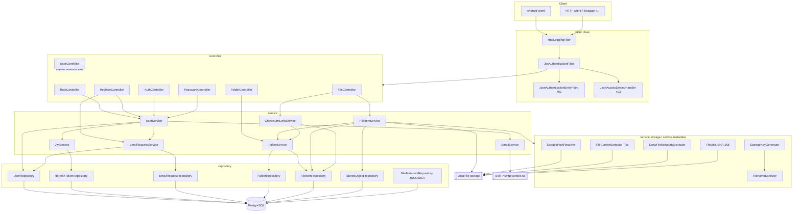
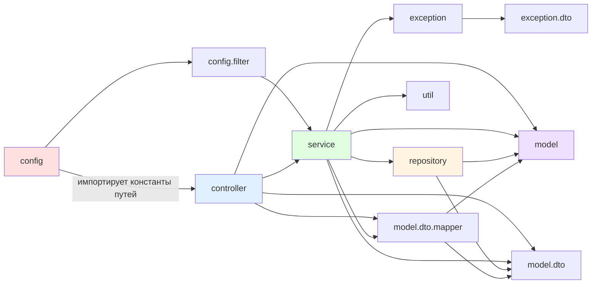

# 02. Architecture

---

## 1. Архитектурный стиль

**[CONFIRMED]** Классический слоистый (layered) монолит Spring Boot с package-by-layer организацией:

```
ru.tbcarus.photocloudserver
├── config            конфигурация + security-фильтры
├── controller        REST-слой
├── exception         исключения + глобальный обработчик + error DTO
├── model             JPA-сущности, enum'ы
│   └── dto           DTO запросов/ответов
│       └── mapper    MapStruct-мапперы
├── repository        Spring Data JPA репозитории
├── service           бизнес-логика
│   ├── metadata      извлечение EXIF
│   ├── storage       работа с физическим хранилищем
│   └── sync          checksum pre-check
└── util              статические утилиты
```

**[CONFIRMED]** Один Gradle-модуль (`settings.gradle`: `rootProject.name = 'photo-cloud-server'`), без подпроектов. Модульных границ (JPMS, ArchUnit, отдельные jar) нет.

**[INFERRED]** Внутри `service` наметился переход к package-by-feature (`storage`, `metadata`, `sync` — самостоятельные подпакеты с собственными интерфейсами и properties), но верхний уровень остаётся package-by-layer.

## 2. Слои: назначение, ключевые классы, входы/выходы, зависимости

### 2.1. Configuration layer (`config`)

| Аспект | Содержание |
| --- | --- |
| Назначение | Bean-определения, конфигурация Spring Security и почты |
| Классы | `SecurityConfig`, `EncoderConfig`, `MailConfig` |
| Входы | `application.yml`, переменные окружения |
| Выходы | `SecurityFilterChain`, `PasswordEncoder` (BCrypt), `JavaMailSender`, `SpringTemplateEngine` |
| Зависит от | `config.filter.*`, констант контроллеров (`ApiPaths`, `*Controller.BASE_URL`) |

**[CONFIRMED][INCONSISTENCY]** `SecurityConfig` импортирует `AuthController`, `RegisterController`, `PasswordController`, `RootController` — конфигурационный слой зависит от контроллеров. Это даёт compile-time связность permitAll-списка с реальными путями, но создаёт обратное направление зависимости (config → controller).

### 2.2. Security filter layer (`config.filter`)

| Класс | Назначение |
| --- | --- |
| `JwtAuthenticationFilter` | Извлекает `Bearer`-токен, проверяет `token_type=ACCESS`, загружает `UserDetails`, заполняет `SecurityContext`; при `ExpiredJwtException`/`JwtException` делегирует 401 в entry point |
| `JsonAuthenticationEntryPoint` | Формирует JSON-ответ `401` с `ErrorResponse` |
| `JsonAccessDeniedHandler` | Формирует JSON-ответ `403` с `ErrorResponse` |
| `HttpLoggingFilter` | `OncePerRequestFilter` с `Ordered.HIGHEST_PRECEDENCE`, логирует метод/URL/тело запроса и статус/тело ответа |

Зависимости: `JwtAuthenticationFilter` → `JwtService`, `UserService`, `JsonAuthenticationEntryPoint`.

### 2.3. Controller layer (`controller`)

| Контроллер | Base URL | Кол-во endpoint'ов |
| --- | --- | --- |
| `RootController` | `/api/v1` | 2 |
| `RegisterController` | `/api/v1/auth/register` | 3 |
| `AuthController` | `/api/v1/auth` | 5 |
| `PasswordController` | `/api/v1/auth/password` | 5 |
| `UserController` | `/api/v1/profile` | 4 |
| `FolderController` | `/api/v1/folders` | 6 |
| `FileController` | `/api/v1/files` | 11 |

- **Входы:** HTTP-запрос, `@Valid`/`@Validated` DTO, `@PathVariable`, `@RequestParam`, `MultipartFile`, `@AuthenticationPrincipal User`.
- **Выходы:** `ResponseEntity<Dto>`, `PageResponse<FileItemDto>`, `ResponseEntity<Resource>`, `Map<String,String>`.
- **Зависят от:** сервисов и (в `FolderController`) от `FolderMapper`.
- `ApiPaths` — единственная константа версии API (`/api/v1`); все пути собираются из констант контроллеров, что делает их переиспользуемыми в `SecurityConfig` и тестах.

### 2.4. Service layer (`service`)

| Сервис | Назначение | Зависимости |
| --- | --- | --- |
| `UserService` (`implements UserDetailsService`) | регистрация, login, logout×3, refresh, запрос/сброс пароля, загрузка `UserDetails` | `UserRepository`, `UserRegisterMapper`, `JwtService`, `PasswordEncoder`, `EmailRequestService`, `EmailService` |
| `JwtService` | генерация/парсинг/валидация/отзыв токенов | `RefreshTokenRepository`, `${token.signing.key}` |
| `EmailRequestService` | генерация кодов, подтверждение регистрации, сброс пароля | `UserRepository`, `EmailRequestRepository`, `PasswordEncoder` |
| `EmailService` | сборка `EmailContext`, рендеринг Thymeleaf, отправка | `JavaMailSender`, `SpringTemplateEngine`, `RequestContextHolder` |
| `FolderService` | дерево папок и все его инварианты | `FolderRepository`, `FileItemRepository` |
| `FileItemService` | весь жизненный цикл файла | `FileItemRepository`, `StoredObjectRepository`, `FolderService`, `FileItemMapper`, `StorageKeyGenerator`, `StoragePathResolver`, `FilenameSanitizer`, `FileContentDetector`, `StorageProperties`, `FileMetadataExtractor`, `PlatformTransactionManager` |
| `ChecksumSyncService` | batch pre-check checksum | `FileItemRepository`, `FolderService`, `ChecksumExistsProperties` |

#### Подпакет `service.storage`

| Класс | Назначение |
| --- | --- |
| `StorageProperties` | `@ConfigurationProperties(prefix = "storage")` |
| `StorageKeyGenerator` | `generateFilePath(userId, checksum)`, `generateFilename(originalName, mime)` |
| `FilenameSanitizer` | `safeName`, `extension`, `limitOriginalNameWithExtension`, `buildPhysicalFilename` |
| `StoragePathResolver` | превращает `(filePath, filename)` в абсолютный `Path`, проверяет выход за `storage.root` |
| `FileContentDetector` | обёртка над `org.apache.tika.Tika` |

#### Подпакет `service.metadata`

`FileMetadataExtractor` (интерфейс) ← `DrewFileMetadataExtractor` (единственная реализация). Возвращает immutable `ExtractedFileMetadata` (`@Value @Builder`).

**[CONFIRMED]** Единственная точка расширения по интерфейсу во всём проекте.

#### Подпакет `service.sync`

`ChecksumSyncService` + `ChecksumExistsProperties`.

### 2.5. Persistence layer (`repository`)

**[CONFIRMED]** 7 интерфейсов `extends JpaRepository`, ни одной реализации вручную, ни одного `EntityManager` в сервисах.

| Repository | Entity | ID-тип в сигнатуре | Заметки |
| --- | --- | --- | --- |
| `UserRepository` | `User` | `Long` | ок |
| `RefreshTokenRepository` | `RefreshToken` | **`Integer`** | **[INCONSISTENCY]** `RefreshToken.id` — `Long` |
| `EmailRequestRepository` | `EmailRequest` | **`Integer`** | **[INCONSISTENCY]** `EmailRequest.id` — `Long` |
| `FolderRepository` | `Folder` | `Long` | ок |
| `FileItemRepository` | `FileItem` | `Long` | ок, `@EntityGraph` на всех методах чтения |
| `StoredObjectRepository` | `StoredObject` | `Long` | ок |
| `FileMetadataRepository` | `FileMetadata` | `Long` | **[UNUSED]** — не инжектится нигде |

### 2.6. Domain/entity layer (`model`)

Сущности: `User`, `RefreshToken`, `EmailRequest`, `Folder`, `FileItem`, `StoredObject`, `FileMetadata`.
Enum'ы: `Role`, `FolderType`, `FileType`, `TokenType`, `EmailRequestType`.
Не-JPA: `EmailContext` (транспортный объект для `EmailService`).

**[CONFIRMED]** Модель почти анемичная. Поведение в сущностях:

- `User implements UserDetails` — `getAuthorities()`, `getUsername()`, `isEnabled()`, `isAccountNonLocked()`;
- `EmailRequest.isActive()/isExpired()` — срок жизни кода (3 дня, константа в самой сущности);
- `FileType.fromMimeType(String)` — классификация MIME;
- `Role.getAuthority()` — префикс `ROLE_`.

**[CONFIRMED][RISK]** `User` — одновременно JPA-сущность и Spring Security principal. Она попадает в `SecurityContext` и в `@AuthenticationPrincipal`, то есть detached-сущность с `password`-хешем живёт на всём протяжении запроса.

### 2.7. DTO layer (`model.dto`)

**[CONFIRMED]** 21 DTO. Стиль смешанный:

- `record` — все request-DTO и часть response (`LoginResponse`, `RefreshResponse`, `UserDto`, `ChecksumExistsResponse`);
- Lombok `@Data @Builder` классы — `FileItemDto`, `FileMetadataDto`, `FolderDto`, `PageResponse<T>`, `FileChecksumDto`.

**[CONFIRMED]** DTO не содержат физических полей (`filePath`, `filename`, `fileExtension`) — это осознанная граница, зафиксированная комментарием в `FileController`: «Контроллер оставляет наружу только логическую FileItem-модель без данных физического хранения».

### 2.8. Mapper layer (`model.dto.mapper`)

| Mapper | Направление |
| --- | --- |
| `FileItemMapper` | `FileItem` → `FileItemDto` (склеивает поля из `FileItem` + `StoredObject`), `FileMetadata` → `FileMetadataDto` |
| `FolderMapper` | `Folder` → `FolderDto` |
| `UserRegisterMapper` | `RegisterRequest` ↔ `User` |

**[CONFIRMED]** MapStruct, `componentModel = SPRING`. `UserRegisterMapper.toUserRegisterDto(User)` — **[UNUSED]**.

### 2.9. Exception layer (`exception`)

`GlobalExceptionHandler` (`@RestControllerAdvice`) + 17 классов исключений + `exception.dto.ErrorResponse`/`ErrorCode`. Подробно — в `10-errors-retries.md`.

### 2.10. Utility layer (`util`)

| Класс | Использование |
| --- | --- |
| `FileUtils` | `writeAndCalculateSHA256` — вызывается из `FileItemService` |
| `ConfigUtil` | `DEFAULT_EXPIRED_DAYS` используется в `EmailRequestService`; `getStringDefaultDays()`, `SELF_COLOR`, `ACTIVE_REQUESTS_MAX` — **[UNUSED]** |
| `DateUtil` | **[UNUSED]** в Java-коде; `getLocalDateTimeNow()`/`DTFORMATTER_RU` вызываются из Thymeleaf-фрагмента `templates/fragments/footer.html` через SpEL `T(...)` |

## 3. Направление зависимостей

**[CONFIRMED]** Фактический граф:

```
config ──────────────► controller (константы путей)  [обратная зависимость]
config.filter ───────► service (JwtService, UserService)
controller ──────────► service, model.dto, model.dto.mapper, model
service ─────────────► repository, model, model.dto, model.dto.mapper, util, exception
service.storage ─────► (только JDK + Tika + Spring)
service.metadata ────► (только JDK + metadata-extractor)
service.sync ────────► repository, service (FolderService), model.dto
repository ──────────► model, model.dto (проекция FileChecksumDto)
model ───────────────► (Spring Security для User/Role)
exception ───────────► exception.dto
```

Основное направление `controller → service → repository → model` соблюдено: **[CONFIRMED]** ни один контроллер не инжектирует репозиторий, ни одна сущность не зависит от сервисов.

## 4. Целевые проверки

### 4.1. Бизнес-логика в контроллерах?

**[CONFIRMED] Почти нет, но не полностью:**

| Контроллер | Что делает сам |
| --- | --- |
| `FileController.getUserFiles()` | строит `Sort` (`capturedAt desc, uploadedAt desc, id desc`), `PageRequest` и вручную собирает `PageResponse` — **логика представления + правило сортировки живут в контроллере**, а не в сервисе |
| `FileController.downloadFile()` | сам собирает `Content-Type` и `Content-Disposition`, обращаясь к `file.getStoredObject().getDetectedMimeType()` — **контроллер знает о физической сущности `StoredObject`**, хотя в комментарии заявлено обратное |
| `FolderController` | вызывает `folderMapper.toDto(...)` в каждом методе (маппинг в контроллере вместо сервиса — в отличие от `FileItemService`, который маппит сам) |
| `UserController.getProfile()` | сам конструирует `UserDto` из 9 полей — маппера для `User → UserDto` нет |

**[INCONSISTENCY]** Разные контроллеры используют разные конвенции маппинга: `FileController` получает готовый DTO из сервиса, `FolderController` маппит сам, `UserController` конструирует DTO вручную.

### 4.2. Persistence-логика в сервисах в обход repository?

**[CONFIRMED] Нет прямого JDBC/`EntityManager`.** Но есть управление транзакциями вручную:

`FileItemService` инжектирует `PlatformTransactionManager` и трижды создаёт `new TransactionTemplate(transactionManager)`:

- `createStoredObjectAndFileItem()`
- `createCopiedStoredObjectAndFileItem()`
- `deleteFileForCurrentUser()`

**[INFERRED]** Причина — нужно держать файловые операции **вне** транзакции, а в транзакцию заворачивать только запись в БД. `@Transactional` на весь метод удерживал бы соединение на время копирования байтов.

**[RISK]** `new TransactionTemplate(...)` создаётся на каждый вызов вместо переиспользуемого поля; кроме того, весь остальной код (`FolderService`) использует декларативный `@Transactional` — два разных подхода в одном проекте.

**[CONFIRMED][RISK]** `renameFileForCurrentUser()`, `moveFileForCurrentUser()`, `copyFileForCurrentUser()` (кроме внутреннего блока), `getUserFiles()`, `getChecksumsForUser()` **не имеют транзакционной границы вообще** — каждый repository-вызов идёт в своей транзакции. Проверка «имя свободно» и `save()` неатомарны.

### 4.3. Циклические зависимости?

**[CONFIRMED] Циклов между бинами нет.** Проверенные потенциально опасные места:

- `FileItemService → FolderService` — односторонняя; `FolderService` инжектирует `FileItemRepository` (не сервис), поэтому цикла `FileItemService ↔ FolderService` нет;
- `ChecksumSyncService → FolderService` — односторонняя;
- `JwtAuthenticationFilter → UserService → JwtService` — цепочка без замыкания;
- `UserService → JwtService → RefreshTokenRepository` — без обратной ссылки.

**[INFERRED]** Пакетный цикл `config ↔ controller` существует на уровне пакетов (config импортирует контроллеры, контроллеры не импортируют config), но это не цикл зависимостей бинов.

### 4.4. Дублирование ответственности?

**[CONFIRMED]** Найдено:

| Дублирование | Где |
| --- | --- |
| Два upload-endpoint'а с идентичным телом | `FileController.uploadFile()` (`POST /files`) и `uploadFileExplicit()` (`POST /files/upload`) — оба вызывают `fileItemService.uploadFile(file, user, folderId)` |
| Два перегруженных `uploadFile` в сервисе | `uploadFile(file, user)` делегирует в `uploadFile(file, user, null)`; 2-аргументная версия используется только тестами |
| Три метода получения refresh token по строке | `JwtService.getRefreshToken()`, `getRefreshTokenForLogout()`, `getRefreshTokenForOwnership()` — последние два идентичны, различаются только исключением |
| Два способа проверить уникальность имени папки | `FolderRepository.findByUserIdAndParentIdAndName()` (используется) и `existsByUserIdAndParentIdAndName()` (**[UNUSED]**) |
| Два способа найти root | `findByUserIdAndParentIsNullAndFolderType()` (**[UNUSED]**) и `findRootByUserId()` (используется) |
| Проверка дубля по checksum в трёх местах | `FileItemService.uploadFile()`, `ensureChecksumAvailableInFolder()`, `ChecksumSyncService.checkExisting()` — три разных запроса к одной инварианте |
| Константы срока email-кода | `EmailRequest.DEFAULT_EXPIRED_DAYS = 3` и `ConfigUtil.DEFAULT_EXPIRED_DAYS = 3` (плюс литерал `3` в `EmailRequestService.checkAndGenerateCode()`) |
| Уникальный индекс папки | `uk_folder_user_parent_lower_name` (migration 10) и `uk_folder_user_parent_name` (migration 12) — частично дублируют друг друга |
| Свой `PageResponse` вместо `Page` | нормально как контракт, но пагинация собирается вручную в контроллере |

### 4.5. Прочие архитектурные наблюдения

**[CONFIRMED]**

- `UserService` совмещает три роли: `UserDetailsService`, auth-сервис (login/logout/refresh) и user-management. Комментарий в классе это признаёт: «Manages users and currently hosts authentication, registration, and password workflows». `TODO.txt` п.9 фиксирует намерение разделить.
- `FileItemService` — 487 строк и 11 зависимостей; самая нагруженная точка системы (upload pipeline, CRUD, download, cleanup, маппинг метаданных).
- Валидация распределена: Bean Validation в DTO + ручные проверки в сервисах (`normalizeOriginalName`, `normalizeName`, `ensureFileNameAvailable`) + constraint'ы БД.

## 5. Архитектурная диаграмма (Mermaid)



## 6. Диаграмма зависимостей слоёв



Красным выделен `config` — единственный слой с обратной зависимостью на `controller`.
