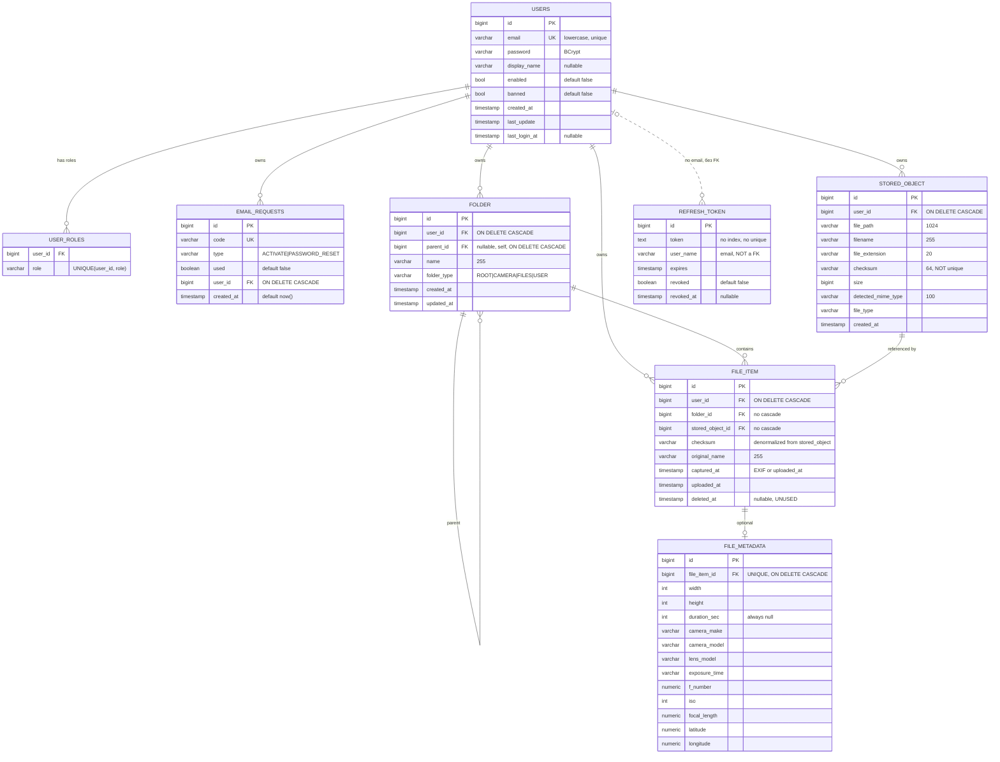

# 03. Data Model

> Логическая модель по JPA-сущностям. Физическая схема (SQL-типы, индексы, constraint'ы) — в `04-database.md`.
> Все сущности используют `@GeneratedValue(strategy = GenerationType.IDENTITY)`, ID-тип `Long`.

---

## 1. Сводка сущностей

| Entity | Таблица | Назначение | Файл |
| --- | --- | --- | --- |
| `User` | `users` (+ `user_roles`) | пользователь и principal Spring Security | `model/User.java` |
| `RefreshToken` | `refresh_token` | выданный refresh token и его состояние отзыва | `model/RefreshToken.java` |
| `EmailRequest` | `email_requests` | одноразовый код активации / сброса пароля | `model/EmailRequest.java` |
| `Folder` | `folder` | узел логического дерева папок | `model/Folder.java` |
| `FileItem` | `file_item` | логическая запись файла в дереве | `model/FileItem.java` |
| `StoredObject` | `stored_object` | физический объект в хранилище | `model/StoredObject.java` |
| `FileMetadata` | `file_metadata` | опциональные EXIF/технические метаданные файла | `model/FileMetadata.java` |

Не-persistent модели: `EmailContext` (транспорт для `EmailService`).

---

## 2. `User`

**Назначение [CONFIRMED]:** учётная запись; одновременно реализует `UserDetails`, попадает в `SecurityContext` и в `@AuthenticationPrincipal`.

| Поле | Java-тип | Колонка | Nullable | Default | Комментарий |
| --- | --- | --- | --- | --- | --- |
| `id` | `Long` | `id` | NOT NULL (PK) | IDENTITY | |
| `email` | `String` | `email` | NOT NULL (в БД) | — | логин; **[CONFIRMED]** приводится к lowercase в `UserService.register()`; unique-индекс `users_email_uindex` |
| `password` | `String` | `password` | NOT NULL (в БД) | — | BCrypt-хеш |
| `displayName` | `String` | `display_name` | NULL | — | добавлено migration 09 вместо `first_name`/`last_name` |
| `enabled` | `boolean` | `enabled` | NOT NULL | `FALSE` | становится `true` после подтверждения email |
| `banned` | `boolean` | `banned` | NOT NULL | `FALSE` | `isAccountNonLocked() = !banned` |
| `roles` | `Set<Role>` | `user_roles.role` | — | — | `@ElementCollection(fetch = EAGER)`, `@Enumerated(STRING)` |
| `createdAt` | `LocalDateTime` | `created_at` | NULL (в БД) | — | `@CreationTimestamp` |
| `lastUpdate` | `LocalDateTime` | `last_update` | NULL (в БД) | — | `@UpdateTimestamp` |
| `lastLoginAt` | `LocalDateTime` | `last_login_at` | NULL | — | обновляется в `UserService.login()` |

**[CONFIRMED][INCONSISTENCY]** `email` и `password` не помечены `@Column(nullable = false)` в сущности, но `NOT NULL` в БД — расхождение уровня аннотаций (на работу не влияет при `ddl-auto: validate`).

**Идентификатор:** `id`. **Уникальность:** `email` (unique-индекс).

**Связи:**
- `1 → N` `EmailRequest` (владелец, обратная сторона; `EmailRequest.user`);
- `1 → N` `Folder`, `FileItem`, `StoredObject` (только со стороны потомков; в `User` нет коллекций);
- `RefreshToken` связан **не FK, а строкой** `user_name = email` — **[CONFIRMED][RISK]**.

**[CONFIRMED]** В `User` нет ни одной `@OneToMany` — навигация только «снизу вверх». Это исключает случайные каскады и N+1 со стороны пользователя.

**Lifecycle:**
```
register() → enabled=false, banned=false, roles={USER}
   ↓ confirmRegistration(code)
enabled=true
   ↓ (админ-функции нет) banned=true → login запрещён
```
**[CONFIRMED]** Удаление пользователя через API невозможно — endpoint'а нет (`TODO.txt` п.13).

**Вычисляемые поля [CONFIRMED]:** `getUsername()` → `email`; `getAuthorities()` → `ROLE_` + имя роли; `isEnabled()`, `isAccountNonLocked()`.

---

## 3. `Role` (enum, не сущность)

**[CONFIRMED]** `USER`, `ADMIN`; `implements GrantedAuthority`, `getAuthority() = "ROLE_" + name()`.
**[UNUSED]** `ADMIN` нигде не назначается и не проверяется.

---

## 4. `RefreshToken`

**Назначение [CONFIRMED]:** серверная запись о выданном refresh token, позволяющая его отозвать.

| Поле | Java-тип | Колонка | Nullable | Default | Комментарий |
| --- | --- | --- | --- | --- | --- |
| `id` | `Long` | `id` | NOT NULL (PK) | IDENTITY | |
| `token` | `String` | `token` | NOT NULL | — | **весь JWT целиком**; тип изменён на `TEXT` в migration 08 |
| `userName` | `String` | `user_name` | NOT NULL | — | email пользователя, **не FK** |
| `expires` | `LocalDateTime` | `expires` | NOT NULL | — | копия `exp` из JWT |
| `revoked` | `boolean` | `revoked` | NULL в БД (`DEFAULT FALSE`) | `FALSE` | |
| `revokedAt` | `LocalDateTime` | `revoked_at` | NULL | — | заполняется только в `JwtService.revoke()` |

**[CONFIRMED][INCONSISTENCY]** `JwtService.revokeList()` (используется в `revokeAll`/`revokeOther`) выставляет `revoked = true`, но **не выставляет `revokedAt`** — после logout-all/logout-others у токенов `revoked=true, revoked_at=NULL`.

**[CONFIRMED][INCONSISTENCY]** Колонка `revoked` в БД nullable (`BOOLEAN DEFAULT FALSE` без `NOT NULL`), а поле в сущности — примитив `boolean`. При `NULL` в колонке Hibernate бросит ошибку маппинга. Текущий код всегда пишет значение, поэтому проблема латентна.

**Уникальность:** отсутствует. **[RISK]** нет unique-constraint и нет индекса на `token`, хотя `findByToken` — самый горячий запрос refresh/logout.

**Связи:** логическая связь с `User` по `user_name = User.email`; FK нет, каскада нет.

**Lifecycle:**
```
login() → new RefreshToken(revoked=false)
   ↓ logout / logout-all / logout-others
revoked=true (terminal, обратного перехода нет)
   ↓ (пассивно) expires < now → протухший
```
**[CONFIRMED]** Ни удаления, ни ротации, ни очистки протухших записей нет — таблица растёт монотонно.

---

## 5. `EmailRequest`

**Назначение [CONFIRMED]:** одноразовый код для активации аккаунта или сброса пароля.

| Поле | Java-тип | Колонка | Nullable | Default | Комментарий |
| --- | --- | --- | --- | --- | --- |
| `id` | `Long` | `id` | NOT NULL (PK) | IDENTITY (`GENERATED ALWAYS`) | |
| `code` | `String` | `code` | NOT NULL | — | `UUID.randomUUID().toString()`; unique `email_requests_code_unique` |
| `type` | `EmailRequestType` | `type` | NOT NULL | — | `@Enumerated(STRING)`: `ACTIVATE`, `PASSWORD_RESET` |
| `used` | `boolean` | `used` | NOT NULL | `FALSE` | |
| `user` | `User` | `user_id` | NOT NULL | — | `@ManyToOne(LAZY)`, `@OnDelete(CASCADE)` |
| `createdAt` | `LocalDateTime` | `created_at` | NOT NULL | `NOW()` | `@CreationTimestamp`, `updatable = false` |

**Константы в сущности [CONFIRMED]:** `DEFAULT_EXPIRED_DAYS = 3`, `ACTIVE_REQUESTS_MAX = 3` (в коде помечены `// Вынести в конфиги`).

**Вычисляемые поля [CONFIRMED]:** `isActive() = createdAt.plusDays(3).isAfter(now)`, `isExpired() = !isActive()`. Срок жизни **не хранится в БД** и не является колонкой.

**Lifecycle:**
```
generateEmailRequest() → used=false
   ↓ confirmRegistration / resetPassword
used=true (terminal)
   ↓ (пассивно) createdAt + 3 дня < now → expired
```
**[CONFIRMED]** При `resetPassword()` помечаются `used=true` **все** незакрытые `PASSWORD_RESET`-коды пользователя за последние 3 дня. При `confirmRegistration()` такой массовой инвалидации нет — прочие `ACTIVATE`-коды остаются `used=false` (**[INCONSISTENCY]** с `TODO.txt` п.10 и `README-description.md`).

**[UNUSED]** `EmailRequestService.delete(EmailRequest)` — пустой метод; записи никогда не удаляются.

---

## 6. `Folder`

**Назначение [CONFIRMED]:** узел логического дерева папок пользователя. Физическое хранилище дерево **не повторяет**.

| Поле | Java-тип | Колонка | Nullable | Default | Комментарий |
| --- | --- | --- | --- | --- | --- |
| `id` | `Long` | `id` | NOT NULL (PK) | IDENTITY | |
| `user` | `User` | `user_id` | NOT NULL | — | `@ManyToOne(LAZY)`, FK `ON DELETE CASCADE` |
| `parent` | `Folder` | `parent_id` | NULL | — | `@ManyToOne(LAZY)`, self-FK `ON DELETE CASCADE`; `NULL` только у `ROOT` |
| `name` | `String` | `name` | NOT NULL, `length=255` | — | trim в `FolderService.normalizeName()` |
| `folderType` | `FolderType` | `folder_type` | NOT NULL, `length=20` | — | `@Enumerated(STRING)` |
| `createdAt` | `LocalDateTime` | `created_at` | NOT NULL, `updatable=false` | `NOW()` | `@CreationTimestamp` |
| `updatedAt` | `LocalDateTime` | `updated_at` | NOT NULL | `NOW()` | `@UpdateTimestamp` |

**Уникальные ограничения [CONFIRMED]:**
- `uk_folder_user_root` — частичный unique-индекс `(user_id) WHERE parent_id IS NULL AND folder_type='ROOT'` → ровно один ROOT на пользователя;
- `uk_folder_user_parent_name` — частичный unique `(user_id, parent_id, lower(name)) WHERE parent_id IS NOT NULL`;
- `uk_folder_user_parent_lower_name` — обычный unique `(user_id, parent_id, lower(name))` из migration 10 (для строк с `parent_id IS NULL` в Postgres не ограничивает);
- CHECK `ck_folder_not_self_parent`: `parent_id IS NULL OR parent_id <> id`.

**[CONFIRMED]** `FolderType`: `ROOT`, `CAMERA`, `FILES`, `USER`.

**Инварианты, реализованные в `FolderService` (не в БД):**
- нельзя создавать папки внутри `CAMERA`/`FILES` (`isSystemLeaf`);
- нельзя rename/move/delete не-`USER` папку (`ensureUserFolder`);
- имена `Camera`/`Files` зарезервированы в `ROOT` (`ensureSystemRootNameIsNotReserved`, case-insensitive);
- нельзя переместить папку в саму себя или в потомка (`ensureNotDescendant`, обход по `getParent()`);
- удалять можно только пустую папку (нет child folder и нет `FileItem`).

**Lifecycle:**
```
ROOT:   создаётся лениво при getOrCreateRoot()   → terminal (нельзя удалить)
CAMERA: создаётся лениво при первом upload IMAGE/VIDEO без folderId → terminal
FILES:  создаётся лениво при первом upload прочих типов без folderId → terminal
USER:   createFolder() → [rename | move]* → deleteFolder() (только если пустая)
```

**Связи:** `N → 1` `User`; `N → 1` `Folder` (parent); `1 → N` `FileItem` (обратная сторона, коллекции в `Folder` нет); `1 → N` `Folder` (дети, коллекции нет).

---

## 7. `FileItem`

**Назначение [CONFIRMED]:** логическая запись файла — «файл, как его видит пользователь».

| Поле | Java-тип | Колонка | Nullable | Default | Комментарий |
| --- | --- | --- | --- | --- | --- |
| `id` | `Long` | `id` | NOT NULL (PK) | IDENTITY | |
| `user` | `User` | `user_id` | NOT NULL | — | `@ManyToOne(LAZY)`, FK `ON DELETE CASCADE` |
| `folder` | `Folder` | `folder_id` | NOT NULL | — | `@ManyToOne(LAZY)`, FK **без** `ON DELETE` |
| `storedObject` | `StoredObject` | `stored_object_id` | NOT NULL | — | `@ManyToOne(LAZY)`, FK **без** `ON DELETE` |
| `checksum` | `String` | `checksum` | NOT NULL, `length=64` | — | **денормализация** из `StoredObject.checksum` (migration 14) |
| `originalName` | `String` | `original_name` | NOT NULL, `length=255` | — | пользовательское имя; переименование меняет только его |
| `capturedAt` | `LocalDateTime` | `captured_at` | NOT NULL | — | EXIF `DateOriginal`/`DateDigitized`, **fallback = `uploadedAt`** |
| `uploadedAt` | `LocalDateTime` | `uploaded_at` | NOT NULL, `updatable=false` | `NOW()` | ставится в сервисе как `LocalDateTime.now()` |
| `deletedAt` | `LocalDateTime` | `deleted_at` | NULL | — | **[UNUSED]** — комментарий в коде: «поле заложено под будущую корзину/soft delete; сейчас используется hard delete» |
| `metadata` | `FileMetadata` | — | NULL | — | `@OneToOne(mappedBy="fileItem", cascade=ALL, orphanRemoval=true, LAZY)` |

**Уникальное ограничение [CONFIRMED]:** `uk_file_item_user_folder_checksum` — `UNIQUE (user_id, folder_id, checksum)` (migration 14). Это **единственное формальное определение «дубликата»** в системе.

**[CONFIRMED]** Уникальности `originalName` в БД **нет** — правило «имя уникально в папке, кроме CAMERA» реализовано только в `FileItemService.ensureFileNameAvailable()`; в коде оставлен TODO: «Строгая DB-уникальность с исключением CAMERA потребует денормализации или trigger».

**Вычисляемых полей нет.** Денормализованное `checksum` синхронизируется вручную в `FileItemService.saveFileItem()` и `createCopiedStoredObjectAndFileItem()`; в коде оставлен TODO о необходимости следить за синхронизацией.

**Lifecycle:**
```
uploadFile() → создан (deletedAt=null)
   ↓ rename → меняется originalName
   ↓ move   → меняется folder
   ↓ copy   → создаётся НОВЫЙ FileItem + НОВЫЙ StoredObject
   ↓ delete → hard delete строки (deletedAt никогда не заполняется)
```

---

## 8. `StoredObject`

**Назначение [CONFIRMED]:** физический объект в хранилище. Наружу через API **не отдаётся**.

| Поле | Java-тип | Колонка | Nullable | Default | Комментарий |
| --- | --- | --- | --- | --- | --- |
| `id` | `Long` | `id` | NOT NULL (PK) | IDENTITY | |
| `user` | `User` | `user_id` | NOT NULL | — | владелец физического файла, FK `ON DELETE CASCADE` |
| `filePath` | `String` | `file_path` | NOT NULL, `length=1024` | — | относительный каталог: `users/{id}/objects/{cs0:2}/{cs2:4}` |
| `filename` | `String` | `filename` | NOT NULL, `length=255` | — | `{originalName}_{uuid}.{ext}` |
| `fileExtension` | `String` | `file_extension` | NOT NULL, `length=20` | — | нормализованное расширение (может быть пустой строкой) |
| `checksum` | `String` | `checksum` | NOT NULL, `length=64` | — | SHA-256 hex lowercase |
| `size` | `Long` | `size` | NOT NULL | — | байты |
| `detectedMimeType` | `String` | `detected_mime_type` | NOT NULL, `length=100` | — | Tika по содержимому |
| `fileType` | `FileType` | `file_type` | NOT NULL, `length=20` | — | `@Enumerated(STRING)` |
| `createdAt` | `LocalDateTime` | `created_at` | NOT NULL, `updatable=false` | `NOW()` | `@CreationTimestamp` |

**[CONFIRMED]** Уникальности **нет**: `uk_stored_object_user_storage_key` удалён в migration 11, `uk_stored_object_user_checksum` добавлен там же и **удалён** в migration 13. Остался только неуникальный индекс `idx_stored_object_user_checksum`. Следствие: у одного пользователя может быть N `StoredObject` с одинаковым checksum — по одному на каждую папку.

**[CONFIRMED]** Полный путь в БД не хранится (соответствует `TODO.txt` п.18): собирается в `StoragePathResolver.resolve(filePath, filename)`.

**Lifecycle:**
```
uploadFile()/copyFile() → создан (после успешного move/copy байтов)
   ↓ delete владельцем FileItem-а
удаляются все ссылающиеся FileItem → StoredObject → физический файл
```
**[CONFIRMED]** Переиспользования между независимыми загрузками нет: каждая новая загрузка в новую папку создаёт новый `StoredObject`, даже при одинаковом checksum.

---

## 9. `FileMetadata`

**Назначение [CONFIRMED]:** опциональные технические метаданные изображения.

| Поле | Java-тип | Колонка | Nullable | Комментарий |
| --- | --- | --- | --- | --- |
| `id` | `Long` | `id` | NOT NULL (PK) | IDENTITY |
| `fileItem` | `FileItem` | `file_item_id` | NOT NULL, UNIQUE | `@OneToOne(LAZY)`, FK `ON DELETE CASCADE` |
| `width` | `Integer` | `width` | NULL | JPEG/PNG directory |
| `height` | `Integer` | `height` | NULL | |
| `durationSec` | `Integer` | `duration_sec` | NULL | **[CONFIRMED]** всегда `null` — экстрактор не обрабатывает видео |
| `cameraMake` | `String` | `camera_make` | NULL | EXIF IFD0 `TAG_MAKE` |
| `cameraModel` | `String` | `camera_model` | NULL | EXIF IFD0 `TAG_MODEL` |
| `lensModel` | `String` | `lens_model` | NULL | EXIF SubIFD `TAG_LENS_MODEL` |
| `exposureTime` | `String` | `exposure_time` | NULL | строка, `VARCHAR(64)` |
| `fNumber` | `BigDecimal` | `f_number` | NULL | `NUMERIC(10,4)` |
| `iso` | `Integer` | `iso` | NULL | |
| `focalLength` | `BigDecimal` | `focal_length` | NULL | `NUMERIC(10,4)` |
| `latitude` | `BigDecimal` | `latitude` | NULL | `NUMERIC(10,7)`, GPS |
| `longitude` | `BigDecimal` | `longitude` | NULL | `NUMERIC(10,7)`, GPS |

**[CONFIRMED]** Строка создаётся **только если** `ExtractedFileMetadata.hasMetadataFields()` вернул `true` (хотя бы одно поле не `null`). Иначе `FileItem.metadata` остаётся `null` и в DTO приходит `"metadata": null`.

**[CONFIRMED]** `capturedAt` в этой таблице **не хранится** — он поднят на уровень `FileItem`, потому что участвует в сортировке списка.

---

## 10. Enum'ы

| Enum | Значения | Хранится | Где используется |
| --- | --- | --- | --- |
| `Role` | `USER`, `ADMIN` | `user_roles.role` VARCHAR | authorities |
| `FolderType` | `ROOT`, `CAMERA`, `FILES`, `USER` | `folder.folder_type` VARCHAR(20) | инварианты дерева |
| `FileType` | `IMAGE`, `VIDEO`, `AUDIO`, `DOCUMENT`, `ARCHIVE`, `OTHER` | `stored_object.file_type` VARCHAR(20) | выбор default-папки, DTO |
| `EmailRequestType` | `ACTIVATE`, `PASSWORD_RESET` | `email_requests.type` VARCHAR | выбор шаблона письма |
| `TokenType` | `TOKEN_TYPE("token_type")`, `ACCESS`, `REFRESH` | **только в JWT-claim**, не в БД | различение типов токенов |

**[CONFIRMED]** `TokenType` смешивает имя claim'а и его значения в одном enum — `TOKEN_TYPE` служит ключом, `ACCESS`/`REFRESH` значениями.

**[CONFIRMED]** `FileType.fromMimeType()` классифицирует по префиксу (`image/`, `video/`, `audio/`) и по двум явным спискам MIME (документы, архивы); всё прочее → `OTHER`.

---

## 11. Сущности, которых НЕТ

Явно проверено — в модели отсутствуют:

| Отсутствующая сущность | Последствие |
| --- | --- |
| `Device` / `ClientDevice` | **[CONFIRMED]** сервер не различает устройства; refresh token — единственный косвенный признак «сессии» |
| `Session` | **[CONFIRMED]** серверных сессий нет (`STATELESS`) |
| `Album` | **[CONFIRMED]** альбомов нет; их роль частично играют `USER`-папки |
| `Tag` / `Label` | нет поиска и тегирования |
| `Share` / `Permission` / `ACL` | **[CONFIRMED]** sharing не реализован, хотя код `deleteFileForCurrentUser()` уже содержит ветку «не владелец» |
| `Thumbnail` / `Preview` | **[CONFIRMED]** миниатюр нет; колонка `thumbnail_path` существовала в удалённой таблице `media_file` (migration 06), но при переходе на новую модель (migration 10) не перенесена |
| `UploadSession` / `Chunk` | **[CONFIRMED]** нет chunked/resumable upload |
| `SyncSession` / `SyncState` | **[CONFIRMED]** нет состояния синхронизации на сервере |
| `AuditLog` | нет журнала действий |
| `Trash` / `deletedAt`-логика | поле есть, механизма нет |
| `UserSettings` | **[CONFIRMED]** `GET/PATCH /profile/settings` возвращают `501` |
| `AbstractBaseEntity` | **[CONFIRMED]** общего базового класса нет, `id` дублируется в 7 сущностях (`TODO.txt` п.16 упоминает такую идею) |

---

## 12. ER-диаграмма (Mermaid)



---

## 13. Ключевые инварианты модели (сводка)

| # | Инвариант | Где обеспечивается |
| --- | --- | --- |
| 1 | Один `ROOT` на пользователя | БД: `uk_folder_user_root` + `FolderService.createRootRaceSafe()` |
| 2 | Уникальное имя папки в родителе (case-insensitive) | БД: `uk_folder_user_parent_name` + `FolderService.ensureNameIsFree()` |
| 3 | Папка не может быть своим родителем | БД: CHECK `ck_folder_not_self_parent` |
| 4 | Папка не может быть перемещена в своего потомка | Только код: `FolderService.ensureNotDescendant()` |
| 5 | Один `checksum` на `(user, folder)` | БД: `uk_file_item_user_folder_checksum` + проверка в `uploadFile()`/`copyFile()`; **[RISK]** не проверяется в `move` |
| 6 | Уникальное `originalName` в папке (кроме `CAMERA`) | **Только код**: `FileItemService.ensureFileNameAvailable()` |
| 7 | `FileItem.checksum == StoredObject.checksum` | **Только код**, вручную; TODO в `saveFileItem()` |
| 8 | Уникальный email | БД: `users_email_uindex` + `existsByEmail()` |
| 9 | Уникальный `EmailRequest.code` | БД: `email_requests_code_unique` |
| 10 | `FileMetadata` — не более одной на `FileItem` | БД: UNIQUE на `file_item_id` + `@OneToOne` |
