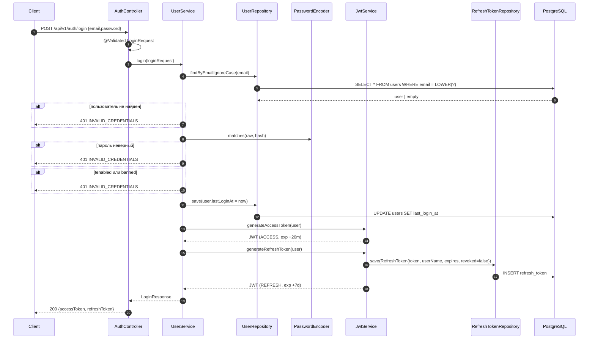
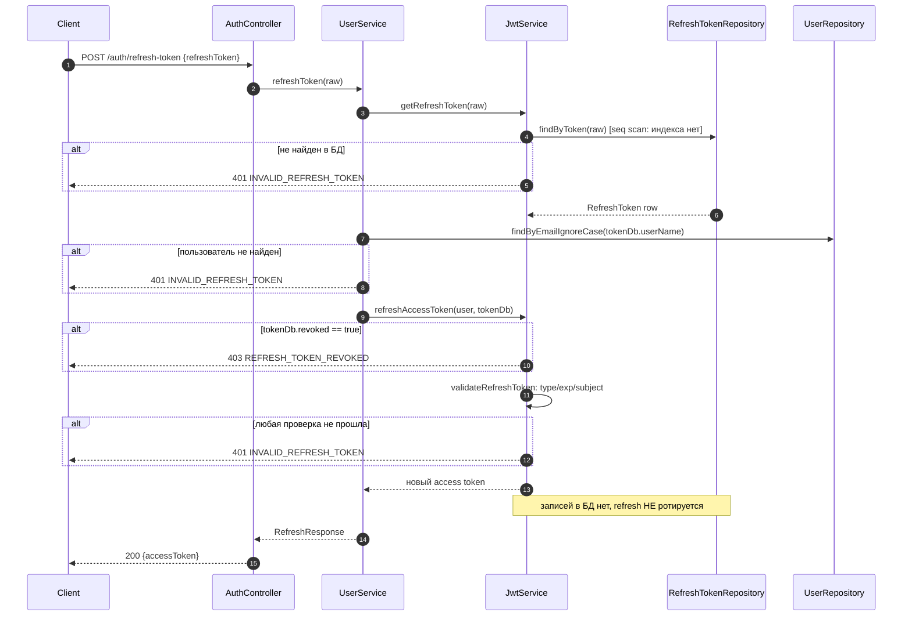
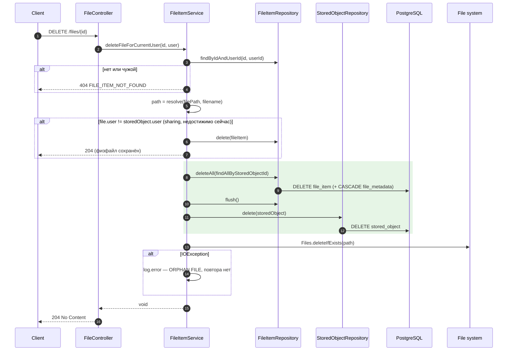

# 08. Business Processes (end-to-end)

> Каждый процесс описан по фактическим вызовам в коде: входные данные → последовательность → классы → изменения БД → операции ФС → ошибки → конечное состояние.

---

## 1. Регистрация и активация

**Вход:** `POST /api/v1/auth/register` `{email, password}`

**Последовательность [CONFIRMED]:**

| # | Класс#метод | Действие |
| --- | --- | --- |
| 1 | `RegisterController.register()` | `@Validated RegisterRequest` |
| 2 | `UserService.register()` | `userRepository.existsByEmail(lowercase)` |
| 3 | `UserRegisterMapper.toUser()` | DTO → entity |
| 4 | `UserService.register()` | `roles={USER}`, email→lowercase, `passwordEncoder.encode()`, `enabled=false`, `banned=false` |
| 5 | `UserRepository.save()` | **INSERT `users`, INSERT `user_roles`** |
| 6 | `EmailRequestService.generateEmailRequest(user, ACTIVATE)` | **INSERT `email_requests`** (`code=UUID`, `used=false`) |
| 7 | `EmailService.sendEmail()` | рендер `email/confirmationTemplate`, ссылка `{scheme}://{host}:{port}/api/v1/auth/register/confirm?code={code}`, отправка SMTP |
| 8 | `RegisterController` | `201 Created` `{"message":"Email was sent"}` |

**Изменения БД:** 3 INSERT (в **разных** транзакциях — метод не `@Transactional`).
**Файловая система:** нет.

**Ошибки:**

| Ситуация | Ответ |
| --- | --- |
| Невалидный email/пароль | `400 VALIDATION_ERROR` |
| Email занят | `409 CONFLICT` |
| `MessagingException` | **поглощается**, пользователь создан, `201` |
| `e.getCause() == null` в catch | **[RISK]** NPE → `500` (пользователь при этом уже создан) |

**Конечное состояние:** `enabled=false` — вход невозможен до активации.

**Активация:** `GET /auth/register/confirm?code=` → `EmailRequestService.confirmRegistration()` → проверка (`!used && type==ACTIVATE && !isExpired()`) → `used=true`, `enabled=true` (dirty checking в `@Transactional`) → `200 text/plain`.

---

## 2. Login

**Вход:** `POST /api/v1/auth/login` `{email, password}`

**Последовательность [CONFIRMED]:** `AuthController.login()` → `UserService.login()`:

```
findByEmailIgnoreCase(email)          → пусто → InvalidCredentialsException
passwordEncoder.matches(raw, hash)    → false → InvalidCredentialsException
!enabled || banned                    → true  → InvalidCredentialsException
user.setLastLoginAt(now()); save      → UPDATE users
jwtService.generateAccessToken(user)  → JWT (token_type=ACCESS, exp=+20 мин)
jwtService.generateRefreshToken(user) → JWT (token_type=REFRESH, jti, exp=+7 дней)
                                      → INSERT refresh_token
return LoginResponse(access, refresh) → 200
```

**Изменения БД:** UPDATE `users.last_login_at`; INSERT `refresh_token`.
**Файловая система:** нет.
**Конечное состояние:** новая активная refresh-запись; прежние остаются активными.



---

## 3. Refresh token

**Вход:** `POST /api/v1/auth/refresh-token` `{refreshToken}` (**без** Authorization-заголовка)

**Последовательность [CONFIRMED]:** `AuthController.refresh()` → `UserService.refreshToken()`:

```
jwtService.getRefreshToken(raw) = refreshTokenRepository.findByToken(raw)
    пусто → InvalidRefreshTokenException → 401
email = tokenDb.getUserName()
userRepository.findByEmailIgnoreCase(email)
    пусто → InvalidRefreshTokenException → 401
jwtService.refreshAccessToken(user, tokenDb):
    tokenDb.isRevoked()                    → TokenRevokedException → 403
    validateRefreshToken(tokenDb):
        token_type != REFRESH              → 401
        isTokenExpired(token)              → 401
        subject != tokenDb.userName        → 401
        JwtException/IllegalArgumentException → 401
    return generateAccessToken(user)
→ 200 {accessToken}
```

**Изменения БД:** **нет** (ни ротации, ни `lastUsedAt`).
**Файловая система:** нет.
**Конечное состояние:** у клиента новый access token; refresh остался прежним.



**[CONFIRMED][RISK]** `enabled`/`banned` в этом процессе не проверяются.

---

## 4. Проверка наличия файла (checksum pre-check)

**[CONFIRMED]** Такой механизм есть: `POST /api/v1/files/checksums/exists`.

**Вход:** `{folderId, checksums[]}` + Bearer access token.

**Последовательность:** `FileController.checkExistingChecksums()` → `ChecksumSyncService.checkExisting()`:

```
1. size > maxBatchSize (500) → IllegalArgumentException → 400
   (проверка ДО обращения к папке и БД)
2. folderService.getFolderForUser(folderId, user) → чужая/нет → 404
3. нормализация: toLowerCase + LinkedHashSet (порядок первого появления)
4. fileItemRepository.findExistingChecksumsInFolder(userId, folderId, set)
   SELECT DISTINCT lower(f.checksum) FROM FileItem f
   WHERE f.user.id=? AND f.folder.id=? AND lower(f.checksum) IN (?)
5. разложение на existing[] / missing[] с сохранением порядка
→ 200 {existing, missing}
```

**Изменения БД:** нет. **Файловая система:** нет.

**Семантика [CONFIRMED]:** «есть ли **логический** `FileItem` с таким checksum **в этой папке**». Тот же checksum в другой папке того же пользователя → `missing`. Чужие файлы на результат не влияют.

**Альтернативный механизм [CONFIRMED]:** `GET /api/v1/files/checksums` — полный список `{id, originalFilename, checksum}` по всем папкам пользователя, без пагинации; помечен в документации как «старый endpoint».

---

## 5. Upload (полный pipeline)

**Вход:** `POST /api/v1/files` (или `/files/upload`), `multipart/form-data`: `file`, опционально `folderId`; Bearer access token.

**Последовательность [CONFIRMED]** (`FileItemService.uploadFile()`):

| # | Шаг | Класс |
| --- | --- | --- |
| 1 | `file.isEmpty()` → `IllegalArgumentException("Файл пустой")` → `400` | `FileItemService` |
| 2 | Создание temp-файла в `storage.temp-dir` | `createTempFile()` |
| 3 | Стриминг `InputStream → OutputStream` с параллельным SHA-256 и подсчётом размера; при превышении лимита — `FileSizeLimitExceededException` | `FileUtils.writeAndCalculateSHA256()` |
| 4 | Определение MIME по **содержимому** temp-файла | `FileContentDetector` (Tika) |
| 5 | `FileType.fromMimeType(mime)` | `FileType` |
| 6 | Извлечение EXIF/GPS (только для `image/*`) | `DrewFileMetadataExtractor` |
| 7 | `uploadedAt = now()`; `capturedAt = EXIF ?: uploadedAt` | `FileItemService` |
| 8 | Выбор папки: `folderId` → `getFolderForUser` (404 при чужой); иначе `getDefaultFolder(user, fileType)` → `Camera` для IMAGE/VIDEO, `Files` для остальных (ленивое создание ROOT и системной папки) | `FolderService` |
| 9 | Санитизация имени, обрезка до 255 | `FilenameSanitizer.limitOriginalNameWithExtension()` |
| 10 | **Проверка дубля:** `findFirstByUserIdAndFolderIdAndChecksumOrderByIdAsc` → если есть: удалить temp и **вернуть существующий DTO** (`200`) | `FileItemRepository` |
| 11 | **Проверка имени:** `ensureFileNameAvailable()` (пропускается для `CAMERA`) → `409` при конфликте | `FileItemService` |
| 12 | Генерация `filePath`, `filename`, `fileExtension` | `StorageKeyGenerator`, `FilenameSanitizer` |
| 13 | `Files.createDirectories()` + `Files.move(ATOMIC_MOVE)` temp → final | `moveTempToFinal()` |
| 14 | **Транзакция:** INSERT `stored_object` → INSERT `file_item` (+ `file_metadata`, если есть хоть одно поле) | `TransactionTemplate` |
| 15 | `FileItemMapper.toDto()` → `200 OK` | `FileItemMapper` |

**Изменения БД:** 1–3 INSERT (плюс возможные INSERT папок).
**Файловая система:** +1 файл (или 0 при дубле).

**Обработка ошибок:**

| Точка | Реакция |
| --- | --- |
| `DataIntegrityViolationException` после move | удалить final, перечитать существующий `FileItem`, вернуть его (гонка) |
| Любой `RuntimeException` после move | удалить final, пробросить |
| Любая ошибка до move | удалить temp, пробросить |

**Конечное состояние:** новый `FileItem` + `StoredObject` + физический файл; либо существующий `FileItem` без изменений.

```mermaid
sequenceDiagram
    autonumber
    participant C as Client
    participant FC as FileController
    participant FIS as FileItemService
    participant FU as FileUtils
    participant TIKA as FileContentDetector
    participant EXIF as DrewFileMetadataExtractor
    participant FOS as FolderService
    participant FS as File system
    participant REPO as FileItem/StoredObject Repos
    participant DB as PostgreSQL

    C->>FC: POST /files (multipart: file, folderId?)
    FC->>FIS: uploadFile(file, user, folderId)
    alt файл пустой
        FIS-->>C: 400 BAD_REQUEST
    end
    FIS->>FS: createTempFile(storage.temp-dir)
    FIS->>FU: writeAndCalculateSHA256(in, out, maxSize)
    FU->>FS: запись потока
    alt размер > max-file-size-bytes
        FU-->>FIS: FileSizeLimitExceededException
        FIS->>FS: delete temp
        FIS-->>C: 413 FILE_TOO_LARGE
    end
    FU-->>FIS: {checksum, size}
    FIS->>TIKA: detectMimeType(temp)
    TIKA-->>FIS: detectedMimeType
    FIS->>EXIF: extract(temp, mime)
    EXIF-->>FIS: ExtractedFileMetadata (пусто для не-image)
    FIS->>FOS: resolveTargetFolder(user, folderId, fileType)
    alt folderId чужой или отсутствует
        FOS-->>C: 404 NOT_FOUND
    end
    FOS->>DB: getOrCreateRoot / getOrCreateSystemChild (ленивый INSERT)
    FOS-->>FIS: Folder
    FIS->>REPO: findFirstByUserIdAndFolderIdAndChecksum
    alt дубль в этой папке
        FIS->>FS: delete temp
        FIS-->>C: 200 существующий FileItemDto (идемпотентно)
    end
    FIS->>REPO: ensureFileNameAvailable (кроме CAMERA)
    alt имя занято
        FIS->>FS: delete temp
        FIS-->>C: 409 CONFLICT
    end
    FIS->>FS: Files.move(temp -> final, ATOMIC_MOVE)
    rect rgb(230,245,230)
    FIS->>REPO: TX { save(StoredObject); save(FileItem[+FileMetadata]) }
    REPO->>DB: INSERT stored_object, file_item, file_metadata
    end
    alt DataIntegrityViolation (гонка по checksum)
        FIS->>FS: delete final
        FIS->>REPO: перечитать существующий FileItem
        FIS-->>C: 200 существующий FileItemDto
    else RuntimeException
        FIS->>FS: delete final
        FIS-->>C: 500
    end
    FIS-->>FC: FileItemDto
    FC-->>C: 200 OK
```

---

## 6. Duplicate detection

**[CONFIRMED]** Определение дубля едино для всей системы: **`user_id + folder_id + checksum`**.

| Уровень | Механизм |
| --- | --- |
| Предупреждающий (клиентский) | `POST /files/checksums/exists` — клиент узнаёт до передачи байтов |
| Проверочный (в upload) | `findFirstByUserIdAndFolderIdAndChecksumOrderByIdAsc` перед move |
| Проверочный (в copy) | `ensureChecksumAvailableInFolder()` → `409` |
| Гарантирующий (БД) | `uk_file_item_user_folder_checksum` |
| Обработка гонки | catch `DataIntegrityViolationException` в `uploadFile()` |
| **Отсутствует** | проверка в `move` → нарушение constraint даёт `500` |

**[CONFIRMED]** Что дублем **не считается**: одинаковые байты в разных папках; одинаковое имя при разном содержимом; одинаковый checksum у разных пользователей.

---

## 7. Получение списка файлов

**Вход:** `GET /api/v1/files?page=0&size=10&folderId=7`

**Последовательность [CONFIRMED]:**

```
FileController.getUserFiles():
    Sort = capturedAt DESC, uploadedAt DESC, id DESC     (жёстко в контроллере)
    Pageable = PageRequest.of(page, size, sort)
FileItemService.getUserFiles(pageable, user, folderId):
    folderId == null → findAllByUserId(userId, pageable)
    иначе            → folderService.getFolderForUser(folderId, user)   [404 при чужой]
                     → findAllByUserIdAndFolderId(userId, folderId, pageable)
    .map(fileItemMapper::toDto)
FileController: сборка PageResponse
```

**[CONFIRMED]** `@EntityGraph(attributePaths={"folder","folder.parent","storedObject","metadata"})` предотвращает N+1 при маппинге.
**Изменения БД / ФС:** нет.
**[CONFIRMED]** Без `folderId` возвращаются файлы **всех** папок; с `folderId` — только прямые файлы папки, без рекурсии.

---

## 8. Получение файла (метаданные) и скачивание

**Метаданные:** `GET /files/{id}` → `findByIdAndUserId` → `404` если нет/чужой → `FileItemDto`. Диск **не проверяется**.

**Скачивание:** `GET /files/{id}/download`:

```
getFileForCurrentUser(id, user)                    → 404 если нет/чужой
StoragePathResolver.resolve(filePath, filename)
new UrlResource(path.toUri())
!exists() || !isReadable()  → FileItemNotFoundException → 404
200 + Content-Type: detectedMimeType
    + Content-Disposition: attachment; filename="<originalName>"
```

**[CONFIRMED]** Range-запросы, ETag и кэширующие заголовки не поддерживаются.

---

## 9. Rename / Move / Copy

### Rename `PATCH /files/{id}`
```
getFileForCurrentUser → normalizeOriginalName(trim + sanitize + 255)
ensureFileNameAvailable(user, folder, name, currentId)   [пропуск для CAMERA]
file.setOriginalName(name); save                        → UPDATE file_item
```
Физическое имя не меняется (подтверждено тестом `renameChangesOnlyOriginalNameAndKeepsPhysicalFilename`).

### Move `POST /files/{id}/move`
```
getFileForCurrentUser → folderService.getFolderForUser(targetFolderId, user)   [404]
ensureFileNameAvailable(...)                            [409 при конфликте имени]
file.setFolder(target); save                            → UPDATE file_item.folder_id
```
**[CONFIRMED][RISK]** checksum в целевой папке не проверяется → `500 DATABASE_CONSTRAINT_VIOLATION` при конфликте.

### Copy `POST /files/{id}/copy`
```
getFileForCurrentUser
targetFolder = request.targetFolderId ?: sourceFile.folder
originalName = request.originalName ?: sourceFile.originalName
ensureFileNameAvailable(...)                            [409]
ensureChecksumAvailableInFolder(...)                    [409]
Files.createDirectories + Files.copy(source -> copied)  ← НОВАЯ физическая копия
TX { save(new StoredObject); save(new FileItem + copyMetadata) }
при ошибке после копирования → delete copied
```
**[CONFIRMED]** `capturedAt` берётся у источника, `uploadedAt = now()`; метаданные копируются полем в поле.

---

## 10. Удаление файла

**Вход:** `DELETE /api/v1/files/{id}`

```
getFileForCurrentUser(id, user)                      → 404 если нет/чужой
path = resolve(storedObject.filePath, filename)
if (file.user.id != storedObject.user.id):           ← ветка «не владелец»
      delete(file)                                    (StoredObject и файл не трогаются)
      return
TX {
    deleteAll(findAllByStoredObjectId(storedObject.id))   ← ВСЕ FileItem на этот объект
    flush()
    delete(storedObject)
}
Files.deleteIfExists(path)      ← вне транзакции; ошибка только логируется
→ 204 No Content
```

**Изменения БД:** DELETE `file_item` (1..N), DELETE `stored_object`, каскадом DELETE `file_metadata`.
**Файловая система:** −1 файл.

**[CONFIRMED]** Hard delete; `deletedAt` не заполняется.
**[CONFIRMED][RISK]** Сбой удаления с диска оставляет orphan-файл без механизма повтора.
**[CONFIRMED]** Ветка «не владелец» покрыта тестом `nonOwnerDeleteRemovesOnlyFileItemAndKeepsStoredObjectAndPhysicalFile`, но в production недостижима: API не позволяет создать `FileItem` на чужой `StoredObject`.



---

## 11. Logout

**Вход:** `POST /api/v1/auth/logout` `{refreshToken}` + Bearer **access** token.

```
JwtAuthenticationFilter аутентифицирует по access token   → 401 если истёк
UserService.logout() → JwtService.revokeOwnedToken(raw, user):
    findByToken(raw)  → пусто → RefreshTokenNotFoundException → 404
    assertOwnedBy()   → чужой → RefreshTokenOwnershipException → 403
    revoke(raw): revoked=true, revokedAt=now(); save        → UPDATE refresh_token
→ 200 {"message":"Logged out successfully"}
```

**`logout-all`:** без тела; `findAllByUserNameAndRevoked(email, false)` → всем `revoked=true` (**`revokedAt` не ставится**).
**`logout-others`:** проверка владения переданным токеном → отзыв всех остальных активных.

**Конечное состояние [CONFIRMED]:** refresh больше не работает; **access token остаётся валидным до 20 минут**.

---

## 12. Повторная загрузка файла

**[CONFIRMED]** Полностью описано в п.5, шаг 10, и в `07-file-storage.md` §5. Матрица:

| Вход | Результат |
| --- | --- |
| Те же байты + та же папка | `200` + существующий `FileItem`, побочных эффектов нет (идемпотентно) |
| Те же байты + другая папка | новый `StoredObject` + новый `FileItem` + новая копия на диске |
| Те же байты + та же папка + другое имя | `200` + существующий `FileItem` **со старым именем** |
| Другие байты + то же имя (не CAMERA) | `409 CONFLICT` |
| Другие байты + то же имя (CAMERA) | новый файл, имена дублируются |
| Параллельная загрузка тех же байтов в ту же папку | один выигрывает, второй ловит `DataIntegrityViolationException`, удаляет свой файл и возвращает `200` с чужой записью |

---

## 13. Восстановление пароля (end-to-end)

```
POST /auth/password/reset/request?email=
    findByEmailIgnoreCase → нет → EntityNotFoundException → 400  [RISK: enumeration]
    generateEmailRequest(user, PASSWORD_RESET)    → INSERT email_requests
    sendEmail: ссылка на /api/v1/auth/password/reset/page?code=...
    → 200 {"message":"Email was sent"}

    ⚠ [INCONSISTENCY] этот URL возвращает 501 — HTML-страницы нет

POST /auth/password/reset/confirm  {password, code}
    getEmailRequestByCode(code) → нет → BadRegistrationRequest → 400
    checkEmailRequest(used/type/expired) → 400
    user.password = BCrypt(password)                → UPDATE users
    emailRequest.used = true
    все PASSWORD_RESET-коды за 3 дня → used = true  → UPDATE email_requests
    → 200 {"message":"Password was reset"}

    ⚠ [RISK] refresh token'ы НЕ отзываются
```

---

## 14. Ленивое создание дерева папок

**[CONFIRMED]** Не отдельный API-процесс, а побочный эффект `GET /folders/root` и upload без `folderId`:

```
getOrCreateRoot(user):
    findRootByUserId → есть → вернуть
    иначе createRootRaceSafe: saveAndFlush(name="root", type=ROOT, parent=null)
        DataIntegrityViolationException (гонка, uk_folder_user_root)
            → перечитать findRootByUserId → вернуть

getDefaultFolder(user, fileType):
    root = getOrCreateRoot(user)
    IMAGE|VIDEO → getOrCreateSystemChild(root, "Camera", CAMERA)
    иначе       → getOrCreateSystemChild(root, "Files",  FILES)
        findByUserIdAndParentIdAndFolderType → есть → вернуть
        иначе createSystemChildRaceSafe (тот же паттерн с перехватом гонки)
```

**[CONFIRMED]** Имена системных папок — константы `FolderService`: `"root"`, `"Camera"`, `"Files"`. Тест `rootIsCreatedOnlyOnce` подтверждает идемпотентность.
