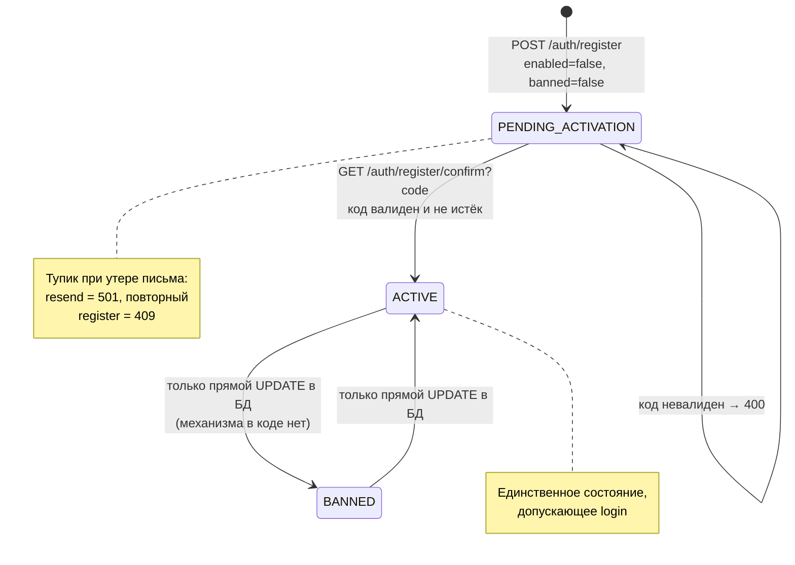
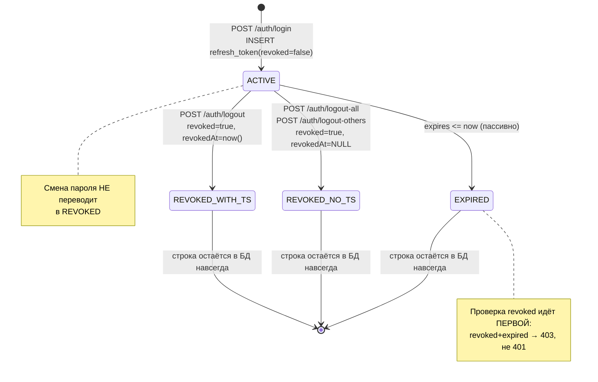
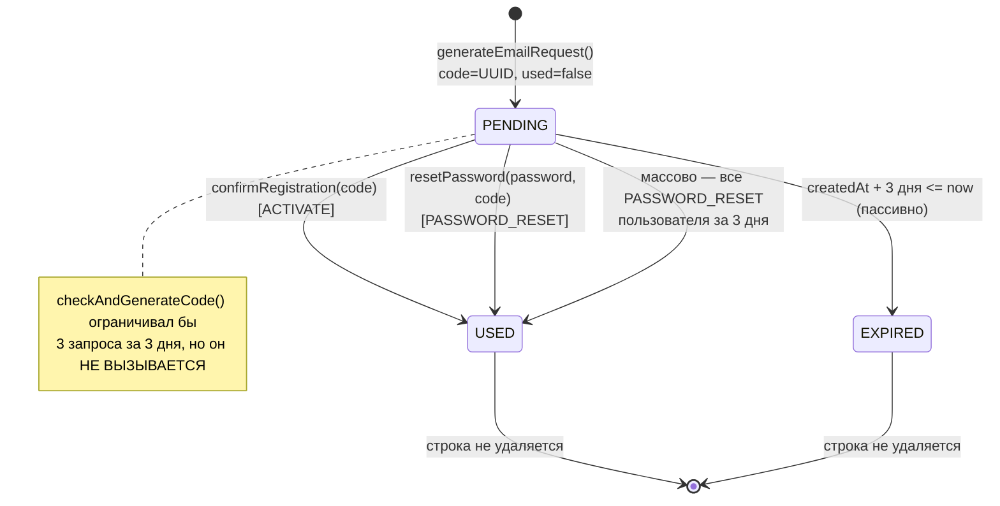
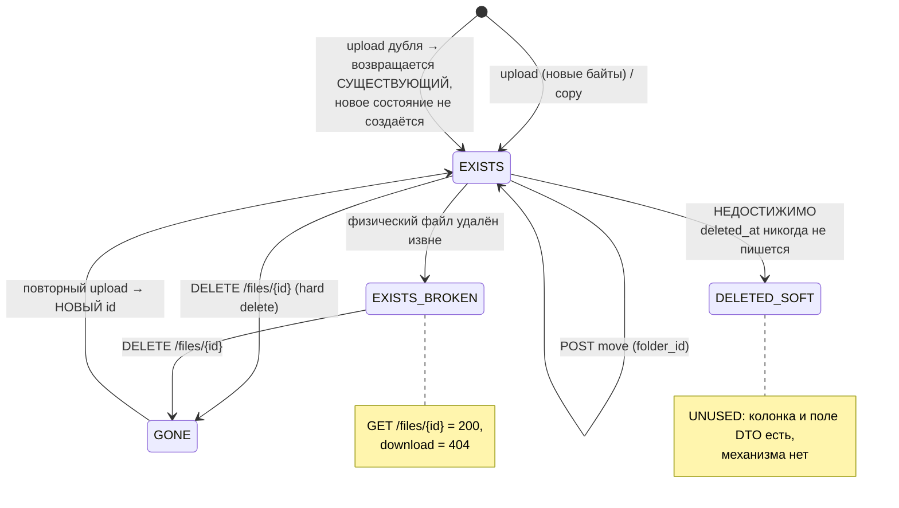

# 09. State Machines

> **[CONFIRMED]** В проекте **нет ни одной формальной state machine**: отсутствуют enum'ы состояний вида `UploadStatus`/`MediaState`/`ProcessingState`, отсутствуют колонки `status`/`state`, отсутствует библиотека state machine.
> Все состояния ниже — фактические, образованные комбинациями булевых флагов, nullable-полей и наличием/отсутствием строк.

---

## 1. Инвентаризация состояний

| Сущность | Носитель состояния | Тип | Формальный? |
| --- | --- | --- | --- |
| `User` | `enabled`, `banned` | 2 boolean | нет |
| `RefreshToken` | `revoked`, `revokedAt`, `expires` | boolean + 2 timestamp | нет |
| `EmailRequest` | `used`, `createdAt` (+3 дня) | boolean + вычисляемый срок | нет |
| `FileItem` | `deletedAt` (**не используется**), `folder` | timestamp, FK | нет |
| `StoredObject` | наличие физического файла на диске | вне БД | нет |
| Upload-процесс | локальные переменные метода (`tempFile`, `finalFile`, `movedToFinal`) | **только в памяти** | нет |
| `Folder` | `folderType`, `parent` | enum + FK | тип, не состояние |

---

## 2. User

### Состояния

| Состояние | `enabled` | `banned` | Может войти? |
| --- | --- | --- | --- |
| `PENDING_ACTIVATION` | `false` | `false` | нет |
| `ACTIVE` | `true` | `false` | **да** |
| `BANNED` | `true` | `true` | нет |
| `BANNED_PENDING` | `false` | `true` | нет |

**Начальное состояние [CONFIRMED]:** `PENDING_ACTIVATION` — `UserService.register()` явно ставит `enabled=false, banned=false`.

### Переходы

| Из | В | Инициатор | Условие | Код |
| --- | --- | --- | --- | --- |
| `PENDING_ACTIVATION` | `ACTIVE` | клиент по ссылке из письма | код `ACTIVATE`, `used=false`, не истёк (3 дня) | `EmailRequestService.confirmRegistration()` |
| любое | `BANNED` | **нет механизма** | — | **[CONFIRMED]** ни endpoint'а, ни сервисного метода; только прямое изменение БД |
| `BANNED` | `ACTIVE` | **нет механизма** | — | там же |

### Ошибки и терминальность

- Код неверен/использован/истёк → `BadRegistrationRequest(NOT_FOUND)` → `400`; состояние не меняется.
- **[CONFIRMED][RISK]** `PENDING_ACTIVATION` фактически терминален при потере письма: resend не реализован (`501`), а повторная регистрация даст `409`. Пользователь становится «мёртвым».
- Удаление пользователя не реализовано.

### Восстановление после сбоя

**[CONFIRMED][RISK]** `UserService.register()` не транзакционен: при падении между `save(user)` и `generateEmailRequest()` пользователь остаётся в `PENDING_ACTIVATION` без единого кода — восстановление невозможно средствами API.



---

## 3. RefreshToken

### Состояния (комбинация `revoked` и `expires`)

| Состояние | `revoked` | `expires` | Годен для refresh? |
| --- | --- | --- | --- |
| `ACTIVE` | `false` | `> now` | **да** |
| `EXPIRED` | `false` | `<= now` | нет (`401`) |
| `REVOKED` | `true` | любой | нет (`403`) |

**Начальное состояние [CONFIRMED]:** `ACTIVE` — `JwtService.generateRefreshToken()` создаёт с `revoked=false`, `expires` = `exp` из JWT (+7 дней).

### Переходы

| Из | В | Инициатор | Механизм | `revokedAt` |
| --- | --- | --- | --- | --- |
| `ACTIVE` | `REVOKED` | `POST /auth/logout` | `JwtService.revoke()` | **заполняется** |
| `ACTIVE` | `REVOKED` | `POST /auth/logout-all` | `revokeList()` | **[INCONSISTENCY]** не заполняется |
| `ACTIVE` | `REVOKED` | `POST /auth/logout-others` | `revokeList()` | **[INCONSISTENCY]** не заполняется |
| `ACTIVE` | `EXPIRED` | время | пассивно, без записи в БД | — |
| `REVOKED` | `ACTIVE` | **невозможен** | — | — |

### Терминальные состояния

**[CONFIRMED]** `REVOKED` и `EXPIRED` терминальны. Строка **никогда не удаляется** — очистки нет, таблица растёт монотонно.

### Ошибки

| Ситуация | Ответ |
| --- | --- |
| Токена нет в БД (refresh) | `401 INVALID_REFRESH_TOKEN` |
| Токена нет в БД (logout) | `404 REFRESH_TOKEN_NOT_FOUND` |
| Токен чужой | `403 REFRESH_TOKEN_OWNERSHIP_ERROR` |
| `revoked=true` | `403 REFRESH_TOKEN_REVOKED` |
| Истёк / неверный тип / subject не совпал | `401 INVALID_REFRESH_TOKEN` |

**[CONFIRMED]** Порядок проверок в `refreshAccessToken()`: сначала `revoked`, потом остальное. Поэтому отозванный **и** истёкший токен даст `403`, а не `401`.

**[CONFIRMED][RISK]** Смена пароля не переводит токены в `REVOKED`.



---

## 4. Access token (состояние вне БД)

**[CONFIRMED]** Не является сущностью и нигде не хранится. Фактические состояния определяются только содержимым JWT:

| Состояние | Условие | Результат |
| --- | --- | --- |
| `VALID` | подпись верна, `token_type=ACCESS`, `exp > now`, `sub` = существующий пользователь | доступ разрешён |
| `EXPIRED` | `exp <= now` | `401` через `ExpiredJwtException` |
| `MALFORMED` | подпись/структура неверны | `401` через `JwtException` |
| `WRONG_TYPE` | `token_type=REFRESH` | фильтр пропускает без аутентификации → `401` на защищённом URL |
| `ORPHANED` | `sub` указывает на несуществующего пользователя | **[RISK] `500`** (`Optional.get()` в `loadUserByUsername`) |

**[CONFIRMED]** Состояния `REVOKED` для access token **не существует** — отозвать его нельзя.

---

## 5. EmailRequest

### Состояния

| Состояние | `used` | Срок | Пригоден? |
| --- | --- | --- | --- |
| `PENDING` | `false` | `createdAt + 3 дня > now` | **да** |
| `USED` | `true` | любой | нет |
| `EXPIRED` | `false` | `createdAt + 3 дня <= now` | нет |

**Начальное состояние [CONFIRMED]:** `PENDING` (`generateEmailRequest()`, `used=false`).

**[CONFIRMED]** Срок жизни — **вычисляемый**, не колонка: `EmailRequest.isActive()` = `createdAt.plusDays(DEFAULT_EXPIRED_DAYS).isAfter(now)`, где константа `= 3` объявлена прямо в сущности с пометкой «Вынести в конфиги».

### Переходы

| Из | В | Инициатор | Условие |
| --- | --- | --- | --- |
| `PENDING` | `USED` | подтверждение регистрации | `type=ACTIVATE`, код совпал |
| `PENDING` | `USED` | подтверждение сброса пароля | `type=PASSWORD_RESET`, код совпал |
| `PENDING` | `USED` | **массово** — при успешном сбросе пароля все `PASSWORD_RESET`-коды пользователя за 3 дня | `EmailRequestService.resetPassword()` |
| `PENDING` | `EXPIRED` | время | пассивно |

**[CONFIRMED][INCONSISTENCY]** Массовая инвалидация реализована **только** для `PASSWORD_RESET`. Для `ACTIVATE` прочие коды остаются `PENDING`, хотя `TODO.txt` п.10 предполагает обратное.

### Терминальность и очистка

`USED` и `EXPIRED` терминальны. `EmailRequestService.delete()` — пустой метод; записи не удаляются никогда.



---

## 6. FileItem

### Фактические состояния

**[CONFIRMED]** Формального статуса нет. Состояние определяется тем, где живёт запись и что с ней связано:

| Состояние | Признак | Достижимо? |
| --- | --- | --- |
| `EXISTS` | строка в `file_item`, `deleted_at IS NULL`, файл на диске есть | **да** — нормальное состояние |
| `EXISTS_BROKEN` | строка есть, `deleted_at IS NULL`, **физического файла нет** | **да** — при внешнем удалении файла |
| `DELETED_SOFT` | `deleted_at IS NOT NULL` | **[UNUSED]** — код никогда не заполняет поле |
| `GONE` | строки нет | **да** — hard delete |

**[CONFIRMED]** Комментарий в `FileItem`: «TODO: поле заложено под будущую корзину/soft delete; сейчас используется hard delete».

### Переходы

| Из | В | Инициатор | Побочные эффекты |
| --- | --- | --- | --- |
| — | `EXISTS` | `POST /files` (новые байты) | +файл, +`stored_object`, +`file_item` |
| — | `EXISTS` | `POST /files/{id}/copy` | +файл (копия), +`stored_object`, +`file_item` |
| `EXISTS` | `EXISTS` | rename | UPDATE `original_name` |
| `EXISTS` | `EXISTS` | move | UPDATE `folder_id` |
| `EXISTS` | `EXISTS_BROKEN` | удаление файла вне приложения | — |
| `EXISTS` | `GONE` | `DELETE /files/{id}` | −файл, −`stored_object`, −все ссылающиеся `file_item` |
| `EXISTS_BROKEN` | `GONE` | `DELETE /files/{id}` | отработает штатно (`deleteIfExists`) |
| `GONE` | `EXISTS` | повторный upload тех же байтов | новая запись с новым `id` |

### Поведение в `EXISTS_BROKEN`

| Операция | Результат |
| --- | --- |
| `GET /files/{id}` | **`200`** — диск не проверяется |
| `GET /files` | файл присутствует в списке |
| `GET /files/{id}/download` | `404 FILE_ITEM_NOT_FOUND` |
| `PATCH`, `move` | работают (только БД) |
| `copy` | `500` — `Files.copy` не найдёт источник |
| `DELETE` | `204` |

**[CONFIRMED][RISK]** Состояние `EXISTS_BROKEN` не диагностируется до попытки скачивания и никак не отражается в API.



---

## 7. Upload-процесс (состояние только в памяти)

**[CONFIRMED]** Самый настоящий конечный автомат в системе — но существующий **только внутри одного вызова метода** `FileItemService.uploadFile()`. Его носители — локальные переменные `tempFile`, `finalFile`, `movedToFinal`.

| Фаза | `tempFile` | `movedToFinal` | Состояние диска | Состояние БД |
| --- | --- | --- | --- | --- |
| `INIT` | null | false | — | — |
| `TEMP_WRITING` | путь | false | пишется temp | — |
| `TEMP_READY` | путь | false | temp готов, checksum посчитан | — |
| `DUPLICATE_FOUND` | null (удалён) | false | temp удалён | без изменений |
| `MOVED` | null | true | final на месте | ещё пусто |
| `PERSISTED` | null | true | final на месте | строки созданы |
| `ROLLED_BACK` | null | true→удалён | final удалён | пусто |

**Переходы и их инициаторы:**

```
INIT --createTempFile--> TEMP_WRITING
TEMP_WRITING --writeAndCalculateSHA256 ok--> TEMP_READY
TEMP_WRITING --лимит размера / IOException--> [cleanup: delete temp] --> FAILED
TEMP_READY --дубль найден--> DUPLICATE_FOUND --> вернуть существующий DTO (200)
TEMP_READY --конфликт имени--> [cleanup] --> FAILED (409)
TEMP_READY --moveTempToFinal--> MOVED
MOVED --TX ok--> PERSISTED --> вернуть новый DTO (200)
MOVED --DataIntegrityViolation--> [delete final] --> вернуть существующий DTO (200)
MOVED --RuntimeException--> ROLLED_BACK --> 500
```

**[CONFIRMED][RISK] Восстановление после сбоя:** так как состояние живёт только в памяти, **аварийное завершение процесса в фазе `MOVED` оставляет orphan-файл навсегда**. Ни журнала, ни таблицы `upload_session`, ни возможности возобновить или откатить незавершённую загрузку нет. Аналогично, падение в `TEMP_WRITING` оставляет мусор в `tmp`.

**[CONFIRMED]** Resumable/chunked upload отсутствует: у загрузки нет состояний `IN_PROGRESS`/`PARTIAL`, и клиент не может продолжить прерванную передачу — только начать заново.

---

## 8. StoredObject

**[CONFIRMED]** Собственного статуса нет. Фактические состояния:

| Состояние | Признак |
| --- | --- |
| `LINKED` | есть ≥1 ссылающийся `FileItem` + файл на диске |
| `BROKEN` | есть `FileItem`, файла нет |
| `ORPHANED_DB` | строка есть, ни одного `FileItem` — **[INFERRED]** недостижимо через API (delete удаляет вместе), но возможно при ручном вмешательстве |
| `ORPHANED_FS` | файл есть, строки нет — **[RISK]** достижимо при сбое (см. `07-file-storage.md` §10.1) |
| `GONE` | ни строки, ни файла |

Обнаружения `ORPHANED_*` в системе нет.

---

## 9. Folder

**[CONFIRMED]** `folderType` — это **тип, а не состояние**: он присваивается при создании и никогда не меняется. Переходов `USER → CAMERA` и т.п. не существует.

| Тип | Создаётся | Rename | Move | Delete |
| --- | --- | --- | --- | --- |
| `ROOT` | лениво, один на пользователя | ✗ 400 | ✗ 400 | ✗ 400 |
| `CAMERA` | лениво при первом upload IMAGE/VIDEO | ✗ 400 | ✗ 400 | ✗ 400 |
| `FILES` | лениво при первом upload прочих типов | ✗ 400 | ✗ 400 | ✗ 400 |
| `USER` | `POST /folders` | ✓ | ✓ | ✓ только если пуста |

Единственное «состояние» — **пустая / непустая**, определяемое запросами `existsByParentId()` и `existsByFolderId()`; оно управляет допустимостью удаления.

---

## 10. Сводка: чего нет

**[CONFIRMED]** Отсутствуют состояния, ожидаемые в системе синхронизации медиа:

| Ожидаемое состояние | Есть? | Комментарий |
| --- | --- | --- |
| `UploadStatus` (`PENDING`/`UPLOADING`/`DONE`/`FAILED`) | **нет** | upload синхронный, состояние только в памяти |
| `ProcessingStatus` (thumbnails, транскодирование) | **нет** | постобработки нет вообще |
| `SyncStatus` на стороне сервера | **нет** | сервер не отслеживает, что клиент уже синхронизировал |
| `MediaState` (`NEW`/`CHECKING`/`TO_UPLOAD`/`UPLOADED`) | **нет** на сервере | описан в `README-description.md` как **клиентская** модель |
| Состояние устройства | **нет** | модели `Device` не существует |
| Trash/корзина | **нет** | `deletedAt` не используется |
| Версии файла | **нет** | |

**[DOCUMENTED]** `README-description.md` подробно описывает клиентские статусы (`НОВЫЙ`, `НА ПРОВЕРКУ`, `НА ПРОВЕРКЕ`, `НА ЗАГРУЗКУ`) — это проектная модель **Android-клиента**, серверу она неизвестна и никак им не поддерживается. Единственная точка соприкосновения — `POST /files/checksums/exists`, отвечающий на вопрос «загружать или нет».
