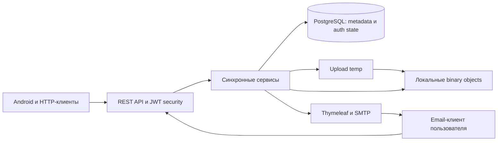

# Система и её границы

Сервер принимает HTTP-запросы клиентов, аутентифицирует пользователя, ограничивает доступ его логическими объектами, сохраняет и выдаёт файлы. Он управляет email-кодами и refresh-токенами. Сканирование устройства, локальные разрешения Android, очередь передачи, локальная БД и сопоставление удалений на телефоне находятся вне его ответственности.

## Источники данных

| Данные | Вход | Authoritative state |
| --- | --- | --- |
| Email и пароль | JSON клиента | Lowercase email и BCrypt hash в users |
| Пользователь/владелец операции | Access JWT subject | Principal заново загружается из users; owner не принимается в upload DTO |
| Байты | Multipart file | Final-файл в локальном storage |
| Имя файла | Имя multipart / JSON rename/copy | Нормализованное FileItem.originalName |
| Папка файла | Клиентский folderId или default по типу | FileItem.folder |
| SHA-256 и размер | Вычисляются по входному потоку | StoredObject; checksum дополнительно в FileItem |
| MIME и FileType | Tika по содержимому → классификация | StoredObject |
| Время съёмки | EXIF Original/Digitized либо серверный fallback | FileItem.capturedAt без timezone offset |
| EXIF/GPS/размер изображения | Из байтов через extractor | Опциональная FileMetadata |
| ID, upload time, physical UUID | Генерируются БД/сервером | Поля сущностей и physical filename |
| Checksums для pre-check | Массив клиента | Ответ о наличии FileItem в заданной папке; не доказательство наличия bytes |
| Refresh и отзыв | Login/logout | refresh_token |
| Email-код и использование | Генерация/подтверждение | email_requests |

Данные EXIF происходят из клиентских байтов; их сохранение не удостоверяет истинность даты или координат. Клиент не передаёт authoritative checksum, size, capturedAt, uploadedAt или статус обработки при upload.

## Persistence и внешние зависимости

PostgreSQL хранит users, user_roles, refresh_token, email_requests, folder, stored_object, file_item, file_metadata. Локальные байты хранятся отдельно; БД не проверяет существование physical path. Поэтому логическое наличие и физическая доступность — разные свойства.

Временные данные: multipart staging servlet-контейнера, `upload-*.tmp`, буфер копирования, результаты MIME/EXIF анализа и principal запроса. Temp может пережить аварийное завершение. Access JWT хранится клиентом; сервер не ведёт его запись или blacklist.

Внешний SMTP участвует в register/reset request синхронно. Успешный HTTP-ответ о письме не является подтверждением доставки. Proxy, TLS termination, mounted volumes, резервные копии и мониторинг окружения этой спецификацией не установлены.

## Сквозные операции

Регистрация создаёт disabled user и код; подтверждение включает user. Login создаёт access/refresh; refresh читает запись и подписывает access; logout меняет revoke state. Upload принимает bytes, анализирует их, выбирает папку, разрешает duplicate/name, переносит temp и сохраняет метаданные. Организация файлов меняет логические записи либо создаёт независимую копию. Download читает bytes после owner lookup; delete раздельно изменяет БД и FS. Подробные последовательности — [08](08-business-processes.md).
