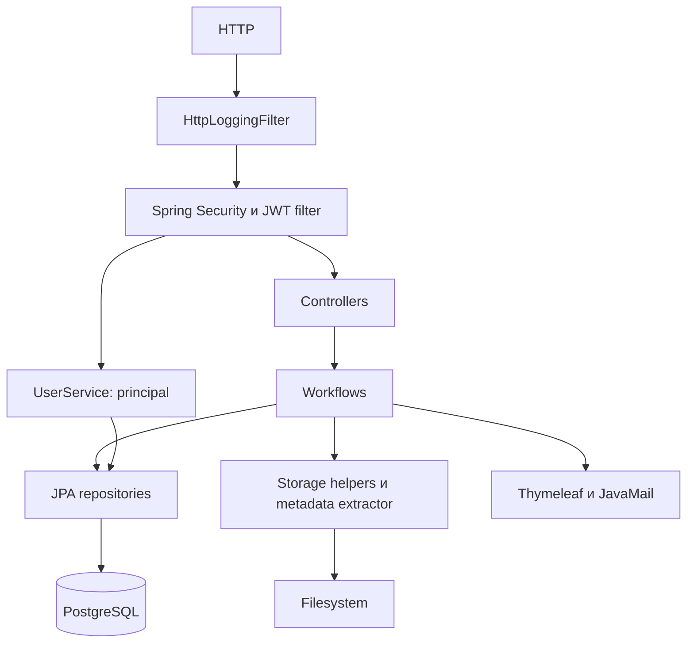

# Архитектура

Сервер — один Spring Boot application в одном Gradle project. Базовый Java package — `ru.tbcarus.photocloudserver`. Граница модуля совпадает с процессом приложения; отдельных deployable сервисов нет.

| Package / слой | Ответственность | Существенные компоненты |
| --- | --- | --- |
| controller | HTTP routes, binding/validation, response status | Root, Register, Auth, Password, User, Folder, File controllers |
| service | Workflows, ownership, domain checks | UserService, JwtService, EmailRequestService, EmailService, FolderService, FileItemService |
| service.sync | Folder-scoped checksum pre-check | ChecksumSyncService и properties |
| service.storage | Пути, имена, MIME и настройки | StoragePathResolver, StorageKeyGenerator, FilenameSanitizer, FileContentDetector, StorageProperties |
| service.metadata | Извлечение metadata из temp | FileMetadataExtractor → DrewFileMetadataExtractor |
| repository | Spring Data JPA и JPQL | Репозитории семи entities; FileMetadataRepository UNUSED в active flow |
| model | Сущности и enum | User одновременно JPA entity и UserDetails |
| model.dto / mapper | Wire contract и MapStruct | FileItemMapper, FolderMapper, UserRegisterMapper |
| config / config.filter | Security chain, BCrypt, mail, HTTP logging | SecurityConfig, EncoderConfig, MailConfig; JWT/JSON security filters |
| exception / dto | Domain exceptions и REST advice | GlobalExceptionHandler, ErrorResponse, ErrorCode |
| util | Потоковый SHA-256 и вспомогательные значения | FileUtils; ConfigUtil; DateUtil используется email footer через шаблон |

## Размещение логики и маппинга

Controllers не выполняют SQL и запись файлов. FileController задаёт fixed sort, PageRequest/PageResponse и download headers. FileItemService возвращает DTO после операций; FolderController маппит результат сервиса; UserController собирает UserDto из principal. RegisterController напрямую обращается к EmailRequestService для подтверждения.

FileItemMapper берёт `mimeType`, `size`, `checksum`, `fileType` из StoredObject, `folderId` из Folder и `originalFilename` из FileItem.originalName. Metadata маппится отдельно. Физические пути и StoredObject ID в FileItemDto не входят. MapStruct implementations генерируются при сборке как Spring beans.

FileItemService непосредственно координирует IO, repository calls и компенсацию. Отдельной абстракции StorageRepository нет. Его TransactionTemplate охватывает записи upload/copy и owner-delete в БД; файловые операции лежат за этими границами. FolderService использует Spring `@Transactional`, email confirm/reset — `jakarta.transaction.Transactional`. UserService register/login и JWT workflows не имеют общей транзакции вокруг всех шагов.

## Зависимости и persistence

Основное направление — controller → service → repository → JPA. Граф packages не является строго однонаправленным: SecurityConfig и EmailService используют константы controllers; FileItemRepository возвращает проекцию FileChecksumDto; User/Role зависят от Spring Security. Это compile-time связи, а не отдельные сервисные вызовы.

FileItemRepository загружает нужные связи через EntityGraph (`folder`, `folder.parent`, `storedObject`, `metadata`). `open-in-view=false`; открытая ORM-сессия на весь HTTP response не предоставляется. SQL-схемой управляет Liquibase, Hibernate выполняет validate. Детали транзакций и ограничений — [04](04-database.md).
