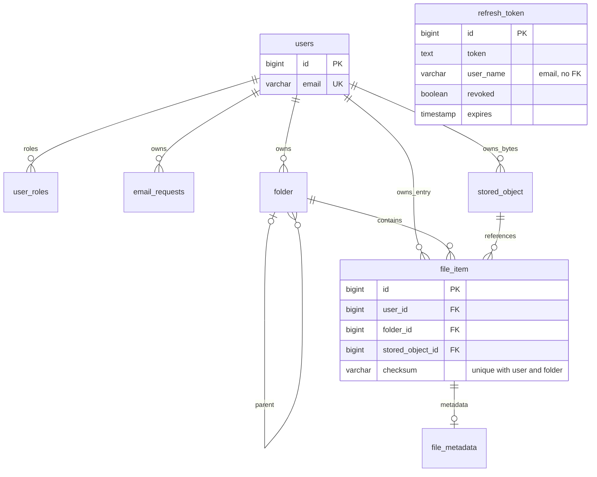

# Logical data model

`FileItem.id` идентифицирует логическую запись файла для всех file endpoints. `StoredObject.id` идентифицирует физический объект в БД. Checksum — lowercase SHA-256 содержимого, а не идентификатор FileItem или уникальный глобальный ключ. Разные FileItem и StoredObject могут иметь один checksum.

Уникальность FileItem действует в пределах `(user_id, folder_id, checksum)`. StoredObject checksum не unique. В обычном upload/copy owner FileItem, Folder и StoredObject совпадает. Схема допускает несколько ссылок на объект, включая cross-owner; API upload/copy таких ссылок не создаёт. Для чтения достаточно владения FileItem. Owner-delete удаляет все ссылки на объект; non-owner-delete только собственную ссылку, даже если она последняя. Refcount/garbage collection отсутствуют.

## User → users

Назначение: учётная запись и Spring Security UserDetails.

| Поле | Java type | Ограничение / default / смысл |
| --- | --- | --- |
| id | Long | @Id IDENTITY; PK БД; null до persistence |
| email | String | JPA без nullable/length; SQL NOT NULL VARCHAR(128), UNIQUE; register lowercases |
| password | String | JPA без ограничений; SQL NOT NULL VARCHAR(128); BCrypt hash |
| displayName | String | Nullable; SQL VARCHAR(128); DTO регистрации не принимает |
| enabled | boolean | Java false; SQL NOT NULL DEFAULT FALSE; после ACTIVATE true |
| banned | boolean | Java false; SQL NOT NULL DEFAULT FALSE; login отклоняет banned |
| roles | Set&lt;Role&gt; | EAGER @ElementCollection; user_roles; register задаёт USER |
| createdAt | LocalDateTime | @CreationTimestamp; SQL nullable |
| lastUpdate | LocalDateTime | @UpdateTimestamp; SQL nullable; обновляется и при login |
| lastLoginAt | LocalDateTime | Nullable; устанавливается UserService.login |

Связи: roles — коллекция значений; обратных collections файлов/папок/кодов нет. getUsername() вычисляет email; getAuthorities() создаёт ROLE_USER/ROLE_ADMIN; isAccountNonLocked() = !banned. Жизненный цикл: регистрация disabled → подтверждение enabled; API ban/unban/delete/profile update не реализован.

## RefreshToken → refresh_token

| Поле | Java type | Ограничение / default / смысл |
| --- | --- | --- |
| id | Long | @Id IDENTITY |
| token | String | SQL TEXT NOT NULL; полный подписанный JWT; JPA без TEXT mapping |
| userName | String | SQL VARCHAR(255) NOT NULL; email, не User relation |
| expires | LocalDateTime | SQL NOT NULL; копия exp JWT в timezone JVM |
| revoked | boolean | Java false; SQL nullable DEFAULT FALSE |
| revokedAt | LocalDateTime | Nullable; single revoke задаёт now, bulk revoke не задаёт |

Связи/FK: отсутствуют. Unique token не установлен. Новый login создаёт новую строку; refresh только читает и выдаёт access; expiry не удаляет строку. Проверка срока в refresh использует JWT exp, а не expires БД. AccessToken entity отсутствует. Repository объявляет ID Integer при Long в entity (RISK-SRV-031).

## EmailRequest → email_requests

| Поле | Java type | Ограничение / default / смысл |
| --- | --- | --- |
| id | Long | @Id IDENTITY; SQL GENERATED ALWAYS |
| code | String | UUID string; SQL NOT NULL UNIQUE VARCHAR(255); JPA ограничения не повторены |
| type | EmailRequestType | STRING: ACTIVATE / PASSWORD_RESET; SQL NOT NULL |
| used | boolean | Java false; SQL NOT NULL DEFAULT FALSE |
| user | User | LAZY ManyToOne, @OnDelete CASCADE; SQL user_id NOT NULL FK |
| createdAt | LocalDateTime | CreationTimestamp, updatable=false; SQL NOT NULL DEFAULT NOW() |

isActive() проверяет только createdAt + 3 days > now; used и type не участвуют. isExpired() = !isActive(). Сервис отдельно проверяет used/type/expiry; ACTIVATE включает пользователя, PASSWORD_RESET меняет hash и использует актуальные reset-коды. Поля expiresAt нет. EmailRequestRepository объявляет ID Integer при Long в entity (RISK-SRV-031).

## Folder → folder

| Поле | Java type | Ограничение / default / смысл |
| --- | --- | --- |
| id | Long | IDENTITY PK |
| user | User | LAZY ManyToOne; NOT NULL |
| parent | Folder | LAZY ManyToOne; nullable; ROOT без parent |
| name | String | NOT NULL, length 255; service trim |
| folderType | FolderType | NOT NULL STRING length 20; ROOT/CAMERA/FILES/USER |
| createdAt | LocalDateTime | NOT NULL CreationTimestamp, updatable=false; SQL now |
| updatedAt | LocalDateTime | NOT NULL UpdateTimestamp; SQL now |

Collections children нет: repository запрашивает прямых потомков. Сервис создаёт ROOT=root лениво, затем Camera/Files при default upload; USER создаётся только под ROOT/USER. Имена siblings уникальны case-insensitive по SQL expression indexes; отдельный partial unique запрещает второй ROOT. Тип неизменяем через API; системные папки нельзя rename/move/delete. У USER terminal state — физическое удаление пустой строки.

«parent null только у ROOT» обеспечивается создающим кодом, но не SQL CHECK. CHECK запрещает только self-parent; FK не гарантирует принадлежность parent тому же user или отсутствие длинных циклов.

## StoredObject → stored_object

| Поле | Java type | Ограничение / default / смысл |
| --- | --- | --- |
| id | Long | IDENTITY PK |
| user | User | LAZY ManyToOne NOT NULL; владелец байтов |
| filePath | String | NOT NULL length 1024; относительный каталог |
| filename | String | NOT NULL length 255; физическое имя |
| fileExtension | String | NOT NULL length 20; может быть пустой строкой |
| checksum | String | NOT NULL length 64; серверный lowercase SHA-256 |
| size | Long | NOT NULL; фактически прочитанные bytes |
| detectedMimeType | String | NOT NULL length 100; Tika |
| fileType | FileType | NOT NULL STRING length 20 |
| createdAt | LocalDateTime | NOT NULL CreationTimestamp; SQL now |

Checksum indexed, но не unique после migration 13; путь/filename не unique в текущей БД. Входящего API обновления физических полей нет. StoredObject может иметь несколько FileItem по модели, но normal upload/copy создают новый объект. При owner delete удаляются все references, затем объект, затем bytes.

## FileItem → file_item

| Поле | Java type | Ограничение / default / смысл |
| --- | --- | --- |
| id | Long | IDENTITY PK; ID, используемый клиентом во всех file endpoints |
| user | User | LAZY ManyToOne NOT NULL; владелец логической записи |
| folder | Folder | LAZY ManyToOne NOT NULL |
| storedObject | StoredObject | LAZY ManyToOne NOT NULL |
| checksum | String | NOT NULL length 64; копия StoredObject.checksum |
| originalName | String | NOT NULL length 255; логическое имя |
| capturedAt | LocalDateTime | NOT NULL; EXIF либо uploadedAt |
| uploadedAt | LocalDateTime | NOT NULL, updatable=false; service now; SQL default now |
| deletedAt | LocalDateTime | Nullable, не заполняется текущим API |
| metadata | FileMetadata | Optional LAZY OneToOne mappedBy; Cascade.ALL + orphanRemoval |

Unique (user,folder,checksum) обеспечен migration 14. Равенство владельцев FileItem/Folder/StoredObject не обеспечено композитными FK. Rename меняет originalName, move — folder, copy создаёт другой FileItem и StoredObject. uploadedAt copy новый, capturedAt copy наследуется. Флаг uploaded/status отсутствует: успешность представлена наличием строки и bytes, а не отдельным полем.

## FileMetadata → file_metadata

| Поле | Java type | Nullable и смысл |
| --- | --- | --- |
| id | Long | PK IDENTITY |
| fileItem | FileItem | NOT NULL UNIQUE FK; владеющая сторона OneToOne |
| width | Integer | Nullable, ширина JPEG/PNG |
| height | Integer | Nullable, высота JPEG/PNG |
| durationSec | Integer | Nullable; текущий extractor не задаёт |
| cameraMake | String | Nullable; EXIF Make |
| cameraModel | String | Nullable; EXIF Model |
| lensModel | String | Nullable; EXIF LensModel |
| exposureTime | String | Nullable; EXIF строка, не числовая длительность |
| fNumber | BigDecimal | Nullable; EXIF rational |
| iso | Integer | Nullable; EXIF ISO |
| focalLength | BigDecimal | Nullable; EXIF rational |
| latitude | BigDecimal | Nullable; GPS |
| longitude | BigDecimal | Nullable; GPS |

Строка создаётся только если ExtractedFileMetadata.hasMetadataFields() true. capturedAt в этом условии не участвует и хранится в FileItem. Copy дублирует metadata, delete FileItem каскадно удаляет. SQL precision/length отличаются от неуточнённых JPA defaults, см. [04](04-database.md).

## Enum и границы модели

| Enum | Значения | Смысл |
| --- | --- | --- |
| Role | USER, ADMIN | Authorities; ADMIN не имеет отдельной прикладной операции |
| FolderType | ROOT, CAMERA, FILES, USER | Категория папки, неизменяемая через API |
| FileType | IMAGE, VIDEO, AUDIO, DOCUMENT, ARCHIVE, OTHER | Классификация MIME, не статус обработки |
| EmailRequestType | ACTIVATE, PASSWORD_RESET | Назначение кода |
| TokenType | ACCESS, REFRESH; имя claim token_type | Тип JWT |

Отдельных Photo/Video/Album/Device/UploadSession/SyncSession/ACL/UserSettings entities нет. EmailContext и результат extractor — временные объекты. `deletedAt` UNUSED: текущие записи upload/copy создаются без него; hard delete не сохраняет tombstone. Произвольные внешние записи БД не превращают это поле в поддерживаемую корзину.

## ER diagram

RefreshToken намеренно не соединён FK-линией с User. Кардинальность StoredObject → FileItem описывает допустимую структуру данных, а не доступное sharing API.
