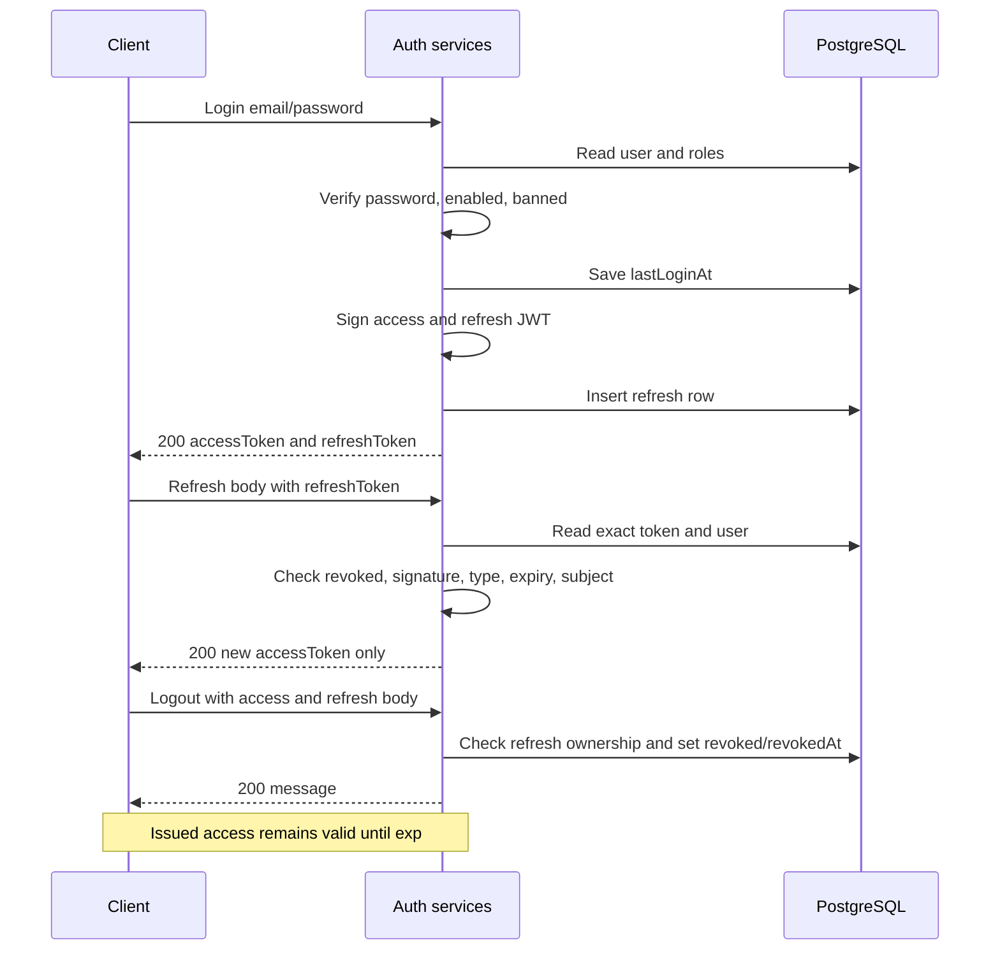
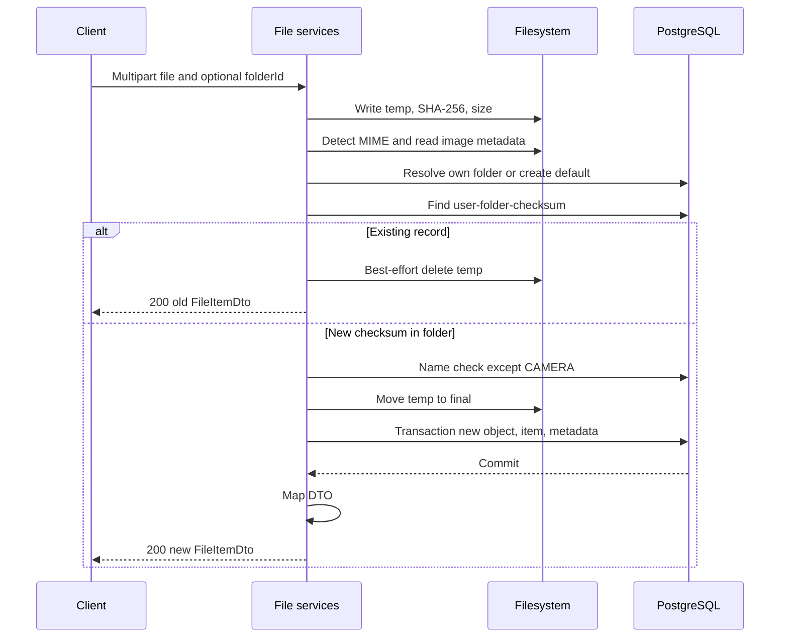

# End-to-end процессы

Все процессы выполняются в рамках HTTP-запроса. Приведённые стадии — последовательность вызовов, а не persisted status enum. Формы запросов и ответы определены в [05](05-api.md), сценарии отказа — в [10](10-errors-and-recovery.md).

## Регистрация и восстановление пароля

Register: validate email/password → проверить email → BCrypt → сохранить disabled User/USER role → сохранить ACTIVATE code → собрать ссылку и HTML → SMTP →201. Нет общей transaction user/code/SMTP. Confirm: найти code → проверить type/used/3days → найти его User → в transaction enabled=true и used=true →200 text. Повтор code→400.

Reset request: обязательный email query → user lookup → создать PASSWORD_RESET code → SMTP →200 message. Письмо ведёт на reset/page?code=..., где GET возвращает501. Сам JSON reset confirm: validate → проверить code → изменить hash и пометить reset-коды в окне3days used →200. JWT state остаётся прежним.

## Login, refresh, logout



Refresh не пишет last-used и не продлевает7days. Logout-all отзывает все неотозванные refresh пользователя; logout-others исключает переданную существующую собственную строку. Эти bulk-операции не заполняют revokedAt. Unknown/foreign refresh logout→404/403. Невалидный Authorization может остановить public refresh до разбора body.

## Папки и bootstrap

GET root получает существующий ROOT или лениво создаёт его. Он не создаёт CAMERA/FILES. Эти папки создаются default upload по типу файла. GET children возвращает только прямых потомков по lower(name), id. Поэтому обязательный folderId для pre-check предполагает уже известную клиенту папку; first-camera bootstrap не определён отдельным endpoint.

USER create: explicit parent или ROOT → normalize name → проверить ROOT/USER parent → reserved/sibling name check → insert. Rename/move разрешены только USER. Move проверяет self/descendant через parent chain и конфликт имени. Delete проверяет отсутствие children и files и удаляет только пустую USER-папку. Все действия меняют БД, не physical storage.

## Checksum pre-check и upload

Exists: DTO validation → проверить raw count ≤500 → ownership папки → lowercase Locale.ROOT + dedup первого появления → запрос DISTINCT lower(FileItem.checksum) → разделить existing/missing с сохранением порядка. Нет reservation, lock или проверки bytes. Его результат может устареть до upload.



Если file transaction падает, сервис пытается удалить собственный final. При DataIntegrityViolation выполняется reread duplicate; найденная запись возвращается200. Ошибка mapping после commit также попадает в cleanup catch. При потерянном ответе сервер не сохраняет «response delivery state». Повтор того же содержимого в неизменённой папке возвращает существующую запись, но не восстанавливает missing bytes и не гарантирует прежний ID после intervening move/delete.

## Чтение и организация файлов

List: optional folder ownership → PageRequest(default0/10) → owner-scoped query с fixed sort capturedAt/uploadedAt/id DESC → DTO page. Без folderId охватывает все FileItem пользователя; с folderId — только прямые файлы. Get metadata читает DB и маппит FileItem, не проверяя FS. Download выполняет owner lookup → resolve path → exists/isReadable → Resource с MIME и attachment filename; bytes не преобразуются.

Rename: owner lookup → trim/sanitize → name check → save originalName → DTO. Move: owner lookup item и target → name check → save folder → DTO; checksum unique может дать500. Copy: owner source/target → name/checksum check → новый physical UUID → Files.copy → transaction новая пара и metadata → DTO. Copy наследует checksum/size/type, не вычисляет их заново; uploadedAt новый, capturedAt прежний.

## Удаление и ownership

```mermaid
sequenceDiagram
    participant C as Client
    participant S as FileItemService
    participant D as PostgreSQL
    participant F as Filesystem
    C->>S: DELETE logical file ID with access
    S->>D: Find FileItem by id and user
    S->>S: Resolve path and compare object owner
    alt Own StoredObject
        S->>D: Transaction delete all references, flush, delete object
        D-->>S: Commit
        S->>F: deleteIfExists
        Note over S,F: IOException logged; DB deletion remains
    else Reference to another owner's object
        S->>D: Delete only own FileItem
    end
    S-->>C: 204 without body
```

Физическое удаление не зависит от подсчёта последних ссылок: owner удаляет все, non-owner сохраняет объект. Следующее удаление прежнего FileItem.id→404. Пустые physical directories остаются. Удаление User не имеет HTTP workflow; прямой SQL cascade не выполняет эту последовательность IO.
